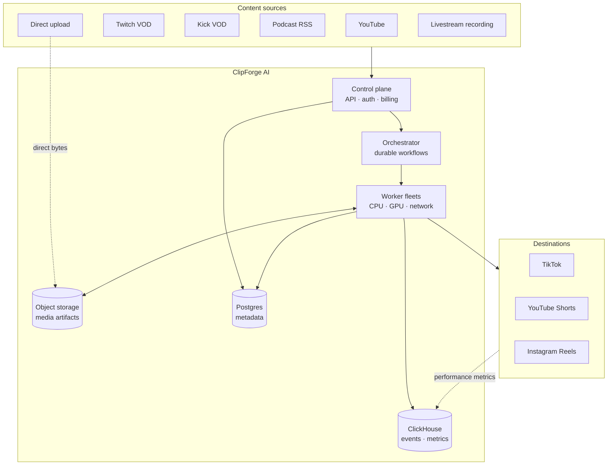
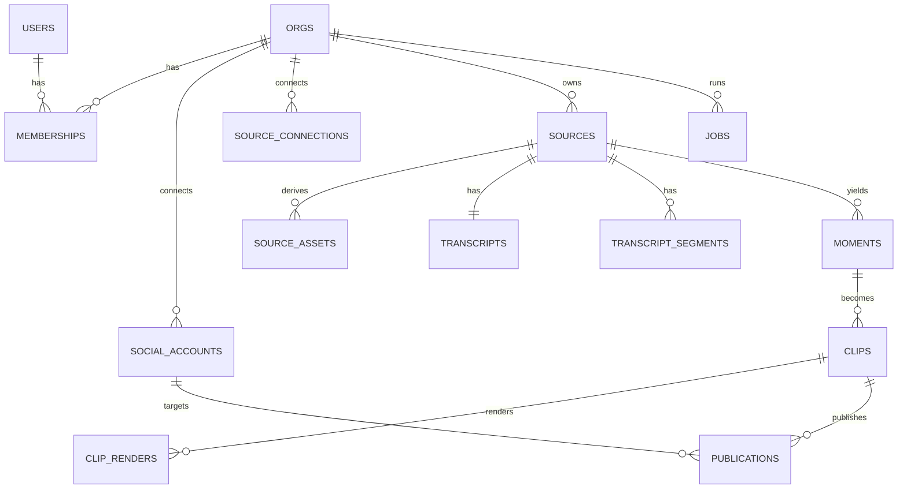
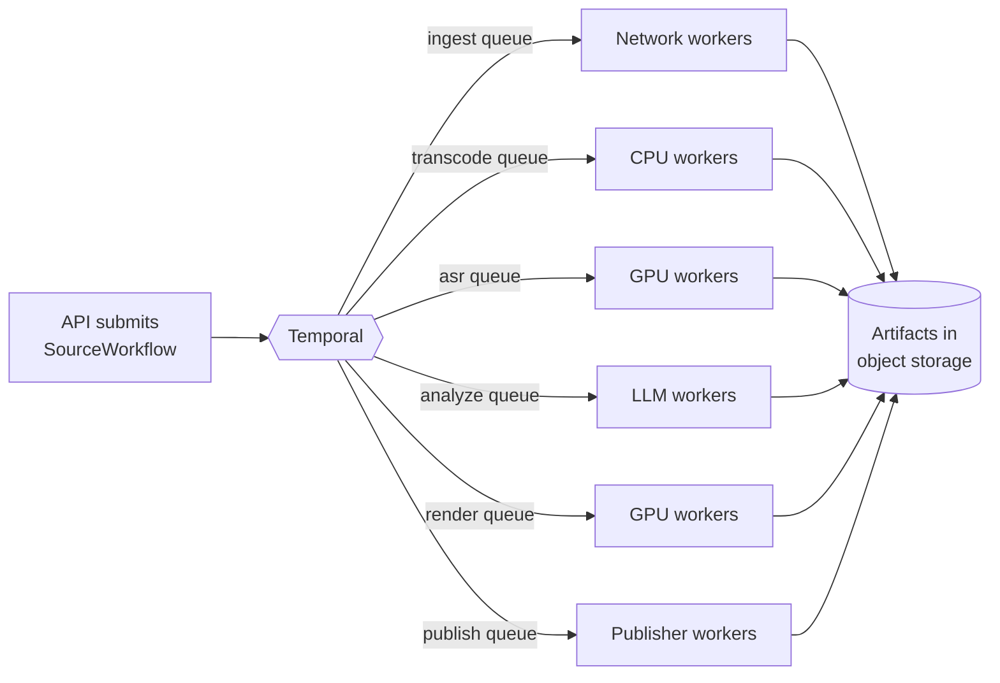
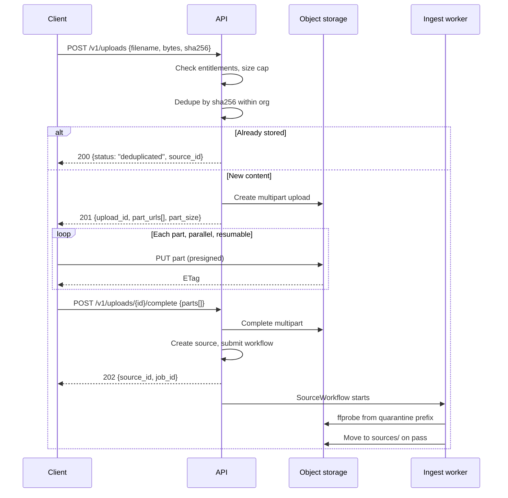
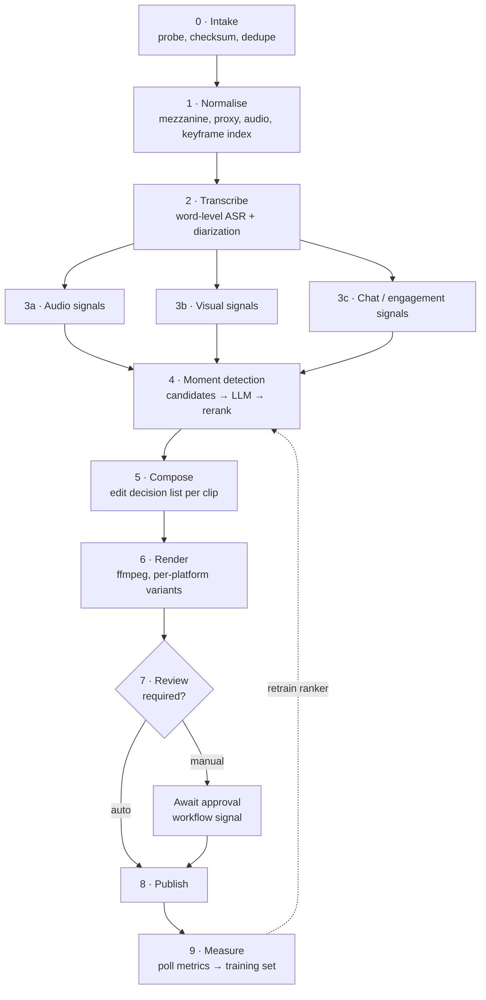

# ClipForge AI — System Architecture

**Status:** Draft v1 · **Owner:** Engineering · **Last updated:** 2026-08-08

Turn long-form content (YouTube, Twitch, Kick, podcasts, uploads, livestream
recordings) into short-form vertical clips published automatically to TikTok,
YouTube Shorts, and Instagram Reels.

This document is the technical foundation for the build. It covers the data
model, API surface, worker fleet, upload path, and processing pipeline, plus
the cross-cutting concerns (cost, security, observability) that decide whether
this is a business or an expensive hobby.

---

## Table of contents

1. [Design principles](#1-design-principles)
2. [System overview](#2-system-overview)
3. [Database architecture](#3-database-architecture)
4. [API architecture](#4-api-architecture)
5. [Worker architecture](#5-worker-architecture)
6. [Upload and storage architecture](#6-upload-and-storage-architecture)
7. [Processing pipeline](#7-processing-pipeline)
8. [Publishing and multi-account](#8-publishing-and-multi-account)
9. [Capacity model and unit economics](#9-capacity-model-and-unit-economics)
10. [Security, privacy, and rights](#10-security-privacy-and-rights)
11. [Observability and reliability](#11-observability-and-reliability)
12. [Scaling path and delivery phases](#12-scaling-path-and-delivery-phases)
13. [Build vs buy](#13-build-vs-buy)
14. [Open questions](#14-open-questions)

---

## 1. Design principles

These are the rules that resolve arguments later. Every decision below traces
back to one of them.

**Separate the control plane from the data plane.** The control plane (API,
auth, billing, metadata) is small, transactional, and must be highly available.
The data plane (transcode, ASR, render) is enormous, bursty, and tolerant of
individual failures. They have opposite scaling and reliability profiles, so
they get different infrastructure, different databases, and different on-call
expectations.

**Video bytes never touch the API.** Media moves client → object storage →
worker → object storage → platform. The API only ever moves pointers. The
moment an application server proxies a 4 GB upload, throughput is capped by web
tier memory and every deploy kills in-flight transfers.

**Every stage is resumable and idempotent.** A nine-stage pipeline where stage 8
fails must not re-run stage 2. Transcription is the single most expensive step;
re-running it because a render crashed is money set on fire. Each stage writes
a durable artifact and is keyed so a retry is a no-op.

**Cost per clip is a first-class metric.** GPU-seconds, LLM tokens, storage
bytes, and egress are attributed to a job, an org, and a plan. If we cannot
answer "what did this clip cost us" we cannot price the product.

**Multi-tenancy is enforced by the database, not by application discipline.**
Row-level security with `org_id` on every tenant table. Application bugs then
produce empty result sets rather than cross-tenant data leaks.

**Fairness is a scheduling requirement, not a nice-to-have.** One customer
backfilling 400 eight-hour VODs must not starve everyone else. Per-org
concurrency limits and weighted queues are in the design from day one.

**Buy the undifferentiated parts.** Auth, billing, and durable orchestration are
solved problems sold by companies whose entire business is being better at them
than we will be. The moat is moment selection and publishing reliability.

---

## 2. System overview

### 2.1 Context



The dotted lines matter as much as the solid ones. Upload bytes bypass the API
entirely, and platform performance data flows back in as a feedback loop that
trains moment ranking — that loop is the long-term differentiator.

### 2.2 Control plane vs data plane

| | Control plane | Data plane |
|---|---|---|
| Workload | CRUD, auth, billing, queries | Transcode, ASR, inference, render |
| Latency target | p99 < 300 ms | Minutes to hours per job |
| Availability | 99.95%, user-visible outage | Degrades to queue depth, invisible short-term |
| Scaling | Modest, request-driven | 100× bursty, queue-driven |
| Compute | Small stateless pods, on-demand | CPU/GPU node pools, heavily spot |
| Failure mode | Page immediately | Retry, then alert on backlog |
| Data store | Postgres (strong consistency) | Object storage + ClickHouse |

Keeping these separate means a viral customer dumping 10,000 hours of VOD into
the system slows down clip delivery but never takes the dashboard offline.

### 2.3 Service decomposition

**Start as a modular monolith for the control plane.** One deployable, strict
internal module boundaries, one database with per-module schema ownership.
Microservices at seed stage buy distributed-systems tax and pay nothing back.

Modules, each owning its tables and exposing an internal interface:

- `identity` — users, orgs, memberships, RBAC, API keys, sessions
- `connections` — OAuth to source platforms and destination accounts, token custody
- `catalog` — sources, assets, transcripts, moments, clips, renders
- `orchestration` — workflow submission, job projection, quota gating
- `publishing` — platform adapters, scheduling, rate budgets
- `billing` — plans, entitlements, metering, Stripe integration
- `insights` — read-only ClickHouse queries for dashboards

Extract a module into its own service only when it needs independent scaling, a
different runtime, or a different failure domain. `publishing` is the likely
first extraction (it is I/O-bound, rate-limited, and needs its own retry
cadence). Worker fleets are already separate deployables from the start.

---

## 3. Database architecture

### 3.1 Storage engine selection

Polyglot, with each store chosen for one job:

| Store | Purpose | Why |
|---|---|---|
| **PostgreSQL 16** | Source of truth: accounts, catalog, jobs, billing | Relational integrity where it matters, JSONB where it doesn't, RLS for tenancy, boring and well-understood |
| **Object storage (R2/S3)** | Media, transcripts, render specs | Bytes do not belong in a database |
| **Redis** | Rate limits, quotas, locks, idempotency, progress, cache | Sub-ms counters and semaphores |
| **ClickHouse** | Usage events, platform metrics, cost attribution | Billions of append-only rows, analytical scans; would destroy Postgres |
| **pgvector** | Transcript embeddings, semantic search, dedupe | Avoids a separate vector database until scale demands one |

Deliberately **not** starting with: Kafka (Postgres outbox + a queue covers
event needs until much later), Elasticsearch (Postgres full-text plus pgvector
is enough), and a separate vector DB (pgvector to ~50M segments).

### 3.2 Tenancy model

**Shared schema, `org_id` on every tenant-scoped table, enforced by row-level
security.**

Schema-per-tenant is tempting for isolation but collapses at thousands of orgs:
migrations become a distributed job, connection pooling fragments, and the
catalog itself becomes a scaling problem. Shared-schema with RLS is what every
system at this scale converges on.

```sql
ALTER TABLE clips ENABLE ROW LEVEL SECURITY;

CREATE POLICY clips_tenant_isolation ON clips
  USING (org_id = current_setting('app.current_org', true)::uuid);
```

Rules that make this safe:

- The application connects as a role **without** `BYPASSRLS`. Migrations and
  admin tooling use a separate role that has it.
- Every request sets `app.current_org` in a transaction-scoped `SET LOCAL`,
  established by middleware, never by handler code.
- `org_id` is the **leading column of every index** on a tenant table. This is
  both a correctness aid and the single most important performance decision —
  it turns cross-tenant scans into per-tenant range scans.
- CI runs a tenancy test suite that attempts cross-org access through every
  public endpoint and fails the build on any leak.

### 3.3 Core schema

Abbreviated to the load-bearing columns.



**Identity and tenancy**

```
orgs(id, name, slug, plan_id, status, stripe_customer_id,
     region, created_at, deleted_at)

users(id, email UNIQUE, name, idp_subject UNIQUE, created_at)

memberships(org_id, user_id, role, created_at)
     PK (org_id, user_id)
     role ∈ {owner, admin, editor, viewer}

api_keys(id, org_id, name, key_hash, prefix, scopes[],
         last_used_at, expires_at, revoked_at)
```

The **org is the billing and isolation boundary**. A user may belong to many
orgs; agencies managing clients depend on this. Never key anything off
`user_id` alone.

**Connected accounts**

```
social_accounts(id, org_id, platform, platform_account_id, handle,
                display_name, avatar_url, status, scopes[],
                credential_ref, token_expires_at,
                rate_limit_state JSONB, connected_by_user_id,
                last_verified_at, created_at)
     UNIQUE (org_id, platform, platform_account_id)
     platform ∈ {tiktok, youtube, instagram}
     status ∈ {active, expired, revoked, suspended, needs_reauth}

source_connections(id, org_id, provider, external_id, credential_ref,
                   auto_ingest BOOL, ingest_filters JSONB,
                   last_polled_at, status)
     provider ∈ {youtube, twitch, kick, rss, drive, dropbox}
```

`credential_ref` is a pointer into the secret store — **never the token
itself**. See §10.1.

`rate_limit_state` caches what we know about the account's remaining platform
quota so the publisher can schedule without probing.

**Content catalog**

```
sources(id, org_id, kind, provider, external_id, origin_url, title,
        duration_ms, published_at, checksum_sha256, status,
        rights_attestation JSONB, metadata JSONB,
        created_by_user_id, created_at, deleted_at)
     UNIQUE (org_id, checksum_sha256) WHERE deleted_at IS NULL
     status ∈ {pending, fetching, ready, processing, complete, failed}

source_assets(id, source_id, org_id, role, storage_key, bytes,
              container, video_codec, audio_codec, width, height,
              fps, created_at)
     role ∈ {original, mezzanine, proxy, audio, keyframe_index, thumbnail}

transcripts(id, source_id, org_id, engine, engine_version, language,
            storage_key, word_count, confidence, created_at)

transcript_segments(id, source_id, org_id, idx, start_ms, end_ms,
                    speaker_label, text, embedding vector(768))
     -- partitioned by hash(source_id)

moments(id, source_id, org_id, start_ms, end_ms, score,
        model_version, rationale, features JSONB, created_at)

clips(id, org_id, source_id, moment_id, title, description, hashtags[],
      start_ms, end_ms, duration_ms, template_id, score, status,
      approved_by_user_id, approved_at, created_at, deleted_at)
     status ∈ {draft, queued, rendering, ready, scheduled,
               published, failed, archived}

clip_renders(id, clip_id, org_id, variant, spec_hash, storage_key,
             cdn_url, bytes, width, height, duration_ms,
             status, render_ms, cost_micros, created_at)
     UNIQUE (clip_id, spec_hash)

publications(id, org_id, clip_id, social_account_id, platform,
             render_id, scheduled_for, submitted_at, published_at,
             platform_post_id, permalink, status, failure_code,
             failure_detail, attempt, idempotency_key, created_at)
     UNIQUE (clip_id, social_account_id) WHERE status <> 'failed'
     status ∈ {scheduled, uploading, processing, published,
               failed, cancelled}
```

Two details worth defending:

`clip_renders` is keyed by `(clip_id, spec_hash)` where `spec_hash` is a hash of
the **declarative render spec** (§7.6). Change a caption colour and you get a
new row; re-request an identical render and you get a cache hit. This makes
renders content-addressed and turns "regenerate" into a lookup most of the time.

`publications` is one row per **clip × destination account**. This is what makes
multi-account real: the same clip going to three TikTok accounts and two
YouTube channels is five rows with independent schedules, retries, and
failure states.

**Orchestration projection**

```
jobs(id, org_id, workflow_id, run_id, type, state, priority,
     source_id, clip_id, attempt, progress_pct, queued_at,
     started_at, finished_at, error_code, error_detail,
     cost_micros, idempotency_key UNIQUE)

job_events(id, job_id, org_id, at, stage, event, detail JSONB)
     -- partitioned monthly, 90-day retention
```

The orchestrator (§5.1) owns execution state; these tables are a **read
projection** for the UI, support, and analytics. Do not build a second source
of truth — write to them from workflow callbacks and accept eventual
consistency.

**Billing and entitlements**

```
plans(id, code, name, price_cents, interval, limits JSONB)

subscriptions(id, org_id, plan_id, stripe_subscription_id, status,
              current_period_start, current_period_end,
              cancel_at_period_end)

entitlements(org_id, key, limit_value, period, updated_at)
     PK (org_id, key)
     -- source_minutes_per_month, clips_per_month, social_accounts,
     -- seats, max_concurrency, max_source_duration_ms, retention_days

usage_counters(org_id, key, period_start, used_value)
     PK (org_id, key, period_start)
```

`entitlements` is materialised from the plan plus any per-org overrides so
enforcement is a single indexed lookup rather than plan-JSON interpretation on
the hot path. `usage_counters` is the durable record; Redis holds the hot
counter and flushes periodically.

**Reliable eventing**

```
outbox(id BIGSERIAL, org_id, aggregate_type, aggregate_id,
       event_type, payload JSONB, created_at, published_at)
     INDEX (published_at) WHERE published_at IS NULL
```

Domain events are written in the **same transaction** as the state change, then
relayed by a poller. This is the only way to avoid the classic bug where the
database commits and the event publish fails, or vice versa.

### 3.4 Partitioning and scale

Target: 1M clips/month, so ~12M clips and ~60M publications in year one, with
`transcript_segments` and `job_events` an order of magnitude larger.

| Table | Strategy | Rationale |
|---|---|---|
| `clips` | RANGE by `created_at`, monthly | Queries are recency-biased; old partitions go cold and compress |
| `publications` | RANGE by `created_at`, monthly | Same access pattern, aligned with clips |
| `transcript_segments` | HASH by `source_id`, 32 ways | Always accessed by source; hash spreads write load evenly |
| `job_events` | RANGE by `at`, monthly, drop at 90d | Pure append log, retention by partition drop |
| Everything else | Unpartitioned | Small enough for years |

Detach-and-archive beats `DELETE` — dropping a partition is instant and does
not generate vacuum pressure.

**Index discipline.** Every tenant query is `(org_id, …)`. Key ones:

```sql
CREATE INDEX ON clips (org_id, created_at DESC);
CREATE INDEX ON clips (org_id, status, created_at DESC)
  WHERE status IN ('draft','queued','rendering');   -- partial: hot working set
CREATE INDEX ON clips (source_id);
CREATE INDEX ON publications (org_id, scheduled_for)
  WHERE status = 'scheduled';                        -- the scheduler's query
CREATE INDEX ON publications (social_account_id, published_at DESC);
CREATE INDEX ON transcript_segments
  USING hnsw (embedding vector_cosine_ops);
```

The partial indexes matter enormously: the scheduler polls "what is due" every
few seconds, and against 60M rows only a partial index on the few thousand
actually-scheduled rows keeps that query sub-millisecond.

**Scaling sequence** — do these in order, only when metrics demand:

1. **Read replicas** for dashboards and analytics reads (immediate, cheap).
2. **PgBouncer** in transaction mode; worker fleets open far more connections
   than Postgres tolerates directly.
3. **Partition** the four tables above at ~10M rows.
4. **Move analytics out** to ClickHouse — already the plan, but enforce it.
5. **Shard with Citus** by `org_id` past ~100M clips. Because `org_id` already
   leads every index and every query, this becomes a migration rather than a
   rewrite. Designing for it now costs nothing; doing it now costs a year.

### 3.5 ClickHouse

Events land here, never in Postgres:

```
usage_events(ts, org_id, job_id, source_id, clip_id, resource,
             quantity, cost_micros, plan_code, region)
     -- resource ∈ {gpu_seconds, cpu_seconds, llm_input_tokens,
     --             llm_output_tokens, storage_gb_hours,
     --             egress_bytes, asr_seconds}

publication_metrics(ts, org_id, publication_id, platform,
                    social_account_id, views, likes, comments,
                    shares, watch_time_seconds, retention_pct)
     -- ReplacingMergeTree, one row per poll

clip_features(clip_id, org_id, published_at, platform, features,
              views_24h, views_7d, engagement_rate)
     -- the training table for the ranking model
```

`clip_features` is the feedback loop made concrete: features we chose the clip
on, joined to what actually happened. Everything in §7.5 about a learned ranker
depends on this table existing from day one, even while the ranker is still
heuristic.

---

## 4. API architecture

### 4.1 Shape

```
Internet
  → Cloudflare (CDN, WAF, DDoS, bot management)
  → API gateway (TLS, routing, coarse rate limit)
  → API service (modular monolith, stateless, autoscaled)
  → Postgres / Redis / orchestrator / object storage
```

**REST over GraphQL.** GraphQL's flexibility is a poor trade here: the domain is
a handful of well-known screens, video metadata caches beautifully at the HTTP
layer, and GraphQL would hand clients the ability to construct expensive
queries against a database where we care deeply about query shape. REST with
deliberate `expand` parameters and cursor pagination gives the same ergonomics
with predictable cost. Internal service-to-service traffic, when services are
eventually extracted, uses gRPC.

### 4.2 Conventions

**Async-first.** Anything touching media returns `202 Accepted` with a job
resource. There is no synchronous "make me a clip" endpoint, because there is
no honest way to hold an HTTP connection for eleven minutes.

```http
POST /v1/sources
→ 202 Accepted
  Location: /v1/jobs/job_01HX…
  { "source": { "id": "src_01HX…", "status": "pending" },
    "job": { "id": "job_01HX…", "state": "queued" } }
```

Clients learn about completion three ways, in order of preference: **webhooks**
(server-to-server), **SSE** on `/v1/events` (dashboard live updates), and
**polling** `/v1/jobs/{id}` (fallback, with `Retry-After`).

**Idempotency on every mutation.** `Idempotency-Key` header, Stripe-style:
the key plus a hash of the request body is stored in Redis for 24 hours with
the response. A retry replays the stored response; a retry with a *different*
body under the same key is a `409`. Without this, a flaky mobile connection
double-charges a customer's quota and double-posts to TikTok.

**Cursor pagination only.** `?limit=50&cursor=…` with an opaque cursor encoding
`(created_at, id)`. `OFFSET` is banned — at page 2,000 of a clip list it becomes
a sequential scan.

**Tiered rate limiting** in Redis, token bucket, evaluated per org, per API key,
and per IP, with plan-based limits. Responses always carry
`RateLimit-Limit`/`RateLimit-Remaining`/`RateLimit-Reset`, and `429` carries
`Retry-After`. Separately, **quota** (monthly minutes) is distinct from **rate**
(requests/second) and returns `402 Payment Required` with a machine-readable
code, not a 429 — clients must be able to tell "slow down" from "you are out of
credit."

**Versioning.** Major version in the path (`/v1`). Within a version, only
additive changes. Breaking changes ship as a dated version pinned per-org
(`ClipForge-Version: 2026-08-01`), the Stripe model — it lets us evolve without
maintaining parallel deployments.

**Consistent errors.**

```json
{ "error": { "type": "invalid_request",
             "code": "source_duration_exceeded",
             "message": "Source is 6h12m; your plan allows up to 4h.",
             "param": "origin_url",
             "doc_url": "https://docs.clipforge.ai/errors/source_duration_exceeded",
             "request_id": "req_01HX…" } }
```

Machine-readable `code` is the contract; `message` is for humans and may change.

### 4.3 Surface

```
# Identity
POST   /v1/orgs                       GET/PATCH /v1/orgs/{id}
GET    /v1/orgs/{id}/members          POST /v1/orgs/{id}/invitations
GET/POST/DELETE  /v1/api-keys

# Connections
POST   /v1/connections/{provider}/authorize   → OAuth redirect
GET    /v1/connections                        DELETE /v1/connections/{id}
GET    /v1/social-accounts                    POST /v1/social-accounts/{id}/verify

# Ingest
POST   /v1/uploads                    → presigned multipart plan
POST   /v1/uploads/{id}/complete
POST   /v1/sources                    → from URL or completed upload
GET    /v1/sources                    GET/DELETE /v1/sources/{id}
GET    /v1/sources/{id}/transcript
POST   /v1/sources/{id}/reprocess

# Clips
GET    /v1/clips                      ?source_id=&status=&min_score=
GET/PATCH/DELETE  /v1/clips/{id}
POST   /v1/clips                      → manual clip at explicit timestamps
POST   /v1/clips/{id}/approve
POST   /v1/clips/{id}/renders         → re-render with a template override
GET    /v1/clips/{id}/renders/{rid}/download   → signed URL, 302

# Publishing
POST   /v1/publications               { clip_id, account_ids[], scheduled_for }
GET    /v1/publications               ?status=&platform=&from=&to=
DELETE /v1/publications/{id}          → cancel if not yet submitted
POST   /v1/publications/{id}/retry

# Templates, jobs, insights
GET/POST/PATCH  /v1/templates
GET    /v1/jobs/{id}                  GET /v1/jobs
GET    /v1/events                     → SSE stream
GET    /v1/insights/clips             ?window=7d&group_by=template
GET    /v1/usage                      → current period consumption

# Webhooks
GET/POST/DELETE  /v1/webhook-endpoints
```

### 4.4 Auth

| Caller | Mechanism |
|---|---|
| Web/mobile app | OIDC via managed IdP → short-lived JWT (10 min) + rotating refresh token in httpOnly cookie |
| Programmatic | API key `cf_live_…`, Argon2id-hashed at rest, scoped, prefix-indexed for lookup |
| Service-to-service | mTLS inside the mesh, SPIFFE identities |
| Inbound platform webhooks | HMAC signature verification + timestamp window + replay cache |
| Outbound webhooks | HMAC-SHA256 over `timestamp.body`, `ClipForge-Signature` header, documented verification |

Org context comes from the token, never from a client-supplied parameter.
Endpoints that accept `org_id` in the path validate it against token claims and
return `404` (not `403`) on mismatch, so probing cannot enumerate orgs.

**RBAC:** `owner` (billing, delete org), `admin` (connections, members,
templates), `editor` (create/approve/publish clips), `viewer` (read). Checked in
middleware against the route's declared requirement, with a default-deny table
so a new endpoint without a declaration fails closed.

---

## 5. Worker architecture

### 5.1 Orchestration: durable workflows, not a chain of queue messages

**Adopt Temporal** (Temporal Cloud initially).

The pipeline is a nine-stage, hours-long, failure-prone workflow with fan-out,
conditional branches, human-in-the-loop approval, and per-stage retry policies.
Implementing that on raw SQS means hand-building a state machine table, a lease
manager, a timeout reaper, a retry policy engine, and a visibility API — that is
six months of work reproducing something that exists, badly, and it will be the
source of most production incidents.

Temporal gives durable execution (workflow state survives worker crashes),
per-activity retry policies, timers that survive restarts, signals for
human-in-the-loop, and searchable execution history for support.

The division of labour:

- **Workflow code** is deterministic orchestration only — no I/O, no randomness.
  It decides *what* happens next.
- **Activities** do all the real work and must be idempotent, because Temporal
  guarantees at-least-once execution.
- **Task queues** map to worker fleets with different hardware (below).



`SourceWorkflow` orchestrates one source end-to-end and spawns a child
`ClipWorkflow` per selected moment. Child workflows isolate failure — one clip
failing to render does not fail the other eleven — and give per-clip visibility
and retry in the UI.

### 5.2 Queue topology

Queues are split by **resource class**, because each scales on a different
signal and has a wildly different cost per second. A single "work" queue would
force GPU nodes to sit idle while network-bound downloads occupy their slots.

| Queue | Work | Bound by | Hardware | Scale signal |
|---|---|---|---|---|
| `ingest` | Fetch from platform, validate, checksum | Network, disk | CPU, high-bandwidth, spot | Queue depth, egress saturation |
| `transcode` | Mezzanine, proxy, audio extract, keyframe index | CPU | Compute-optimised, spot | Queue depth |
| `asr` | Whisper transcription + diarization | GPU | L4 / A10G, spot with checkpoint | Queue depth + GPU utilisation |
| `analyze` | LLM scoring, embedding | External API | Small CPU pods | In-flight requests, token budget |
| `compose` | Speaker tracking, reframe path, caption layout | CPU + light GPU | Mixed, spot | Queue depth |
| `render` | ffmpeg encode | GPU NVENC / CPU | L4, spot with checkpoint | Queue depth, deadline pressure |
| `publish` | Upload to platform APIs | Network + platform quota | Small CPU pods, **on-demand** | Scheduled backlog, per-account budget |
| `metrics` | Poll platform performance | Network | Small CPU pods | Cron |
| `maintenance` | Retention, reconciliation, cleanup | Cheap | Small CPU pods, spot | Cron |

`publish` runs on **on-demand** instances despite the cost. It is low volume,
holds OAuth state mid-upload, and a spot eviction halfway through a resumable
YouTube upload is both user-visible and quota-expensive.

### 5.3 Compute platform

Kubernetes (EKS) with Karpenter provisioning and KEDA scaling on queue depth
rather than CPU — CPU is a lagging indicator for queue-driven work, and scaling
on it means the backlog is already hours deep before nodes arrive.

Node pools:

- `cpu-general` — API, publishers, small workers. On-demand + baseline savings plan.
- `cpu-transcode` — compute-optimised, **80–90% spot**.
- `gpu-asr` — L4, spot-first with on-demand fallback for the scheduled tier.
- `gpu-render` — L4 (NVENC), heavily spot.
- `system` — on-demand, controllers and observability.

**Spot is the margin.** Transcode and render are 60–70% of compute cost and are
perfectly interruptible if the work is checkpointed. Handling it properly:

1. Subscribe to the interruption notice (2 minutes on AWS).
2. Stop accepting new activity tasks immediately.
3. Flush partial artifacts to object storage and record a checkpoint.
4. Fail the activity with a **retryable** error so Temporal reschedules it
   elsewhere, resuming from the checkpoint rather than from zero.

For a long render, checkpoint per output segment; for ASR, per audio chunk. The
difference between naive spot and checkpointed spot is the difference between
"spot is unusable, jobs never finish" and a 60–70% compute discount.

**Keep models warm.** GPU workers load Whisper once at startup and serve many
jobs. Cold-loading a model per job wastes 20–40 seconds of GPU time — at scale
that is a meaningful fraction of the bill. Set `terminationGracePeriodSeconds`
generously and scale GPU pools with hysteresis so they do not thrash.

### 5.4 Multi-tenant fairness

Three mechanisms, layered:

**Per-org concurrency limits** from entitlements, enforced with a Redis
semaphore acquired before an activity starts and released (with TTL, so a dead
worker cannot leak a slot) on completion. Free: 1. Pro: 5. Business: 20.
Enterprise: negotiated.

**Priority lanes** within each queue:

| Lane | Contents | Guarantee |
|---|---|---|
| `interactive` | User is watching — manual clip, preview re-render | Seconds to start |
| `scheduled` | Publication deadline approaching within the hour | Must not miss the slot |
| `standard` | Normal automatic processing | Minutes |
| `bulk` | Backfills, reprocessing, free tier | Best effort, may wait hours |

**Weighted fair dispatch** across orgs within a lane. A dispatcher tracks
recently consumed compute-seconds per org and prefers orgs below their fair
share, weighted by plan. Without this, the first customer to submit 400 VODs
occupies the entire fleet in FIFO order and every other customer's experience
collapses. This is the mechanism that most queue-based systems retrofit after
their first angry enterprise call; it belongs in v1.

**Deadline-aware promotion.** A clip scheduled to publish at 18:00 gets promoted
from `standard` to `scheduled` at 17:00 if it is not yet rendered.

### 5.5 Failure handling

Classify every failure — this taxonomy drives retry policy, alerting, and what
the user sees:

| Class | Examples | Response |
|---|---|---|
| **Transient** | Network blip, 5xx, throttle, spot eviction | Exponential backoff + jitter, up to 5 attempts |
| **Resource** | OOM, disk full, GPU unavailable | Retry on a larger node class, then escalate |
| **Terminal-input** | Corrupt media, unsupported codec, 12-second source | Fail immediately, clear user-facing message, no retry, **no charge** |
| **Terminal-auth** | Revoked OAuth, deleted channel | Fail, mark account `needs_reauth`, notify user |
| **Platform-policy** | TikTok rejects content | Fail, surface the platform's reason verbatim |
| **Unknown** | Anything unclassified | Retry twice, then DLQ and page if the rate exceeds baseline |

Supporting machinery: a **dead letter queue per task queue** with automated
triage; **poison detection** (same job failing identically N times gets
quarantined rather than retried forever); **circuit breakers** on every external
dependency so a YouTube API outage does not consume the entire fleet in retries;
and **no charge on terminal-input failures** — billing for a job that failed
because we could not read the file is how you generate support tickets and
refunds.

---

## 6. Upload and storage architecture

### 6.1 Direct-to-storage, always



Non-negotiables:

- **Presigned URLs scoped tightly**: exact key, content-length range,
  content-type, 15-minute expiry. A leaked URL must not become a free bucket.
- **Multipart with 16–64 MB parts**, uploaded in parallel with per-part retry.
  Creators upload multi-gigabyte files over hotel wifi; resumability is the
  difference between a product and a complaint.
- **Consider `tus`** for the browser client. S3 multipart resumes across
  reconnects but not cleanly across browser sessions; tus does, at the cost of
  running a small tus server. Worth it if the analytics show abandoned uploads.
- **Never trust the client.** Declared content type and extension are hints.
  The ingest worker runs `ffprobe` in a sandboxed, network-isolated container
  before anything else touches the file, and that output is authoritative.
- **Quarantine prefix.** Uploads land in `quarantine/{org}/{upload_id}`. Only
  after probe, size verification, and content scanning do they move to
  `sources/`. The quarantine prefix has an aggressive lifecycle rule (24 hours)
  so abandoned uploads cost nothing.
- **Content-addressed dedupe.** The client computes SHA-256 during selection; if
  the org already has that checksum, we link instead of transfer. Podcasters
  re-uploading the same episode and agencies with shared assets hit this
  constantly — it is free storage savings and an instant upload.

### 6.2 URL-based ingest

For YouTube, Twitch, Kick, and RSS, the client posts a URL and an ingest worker
fetches server-side. Design constraints:

- Fetchers run in an **egress-controlled subnet** with an allowlist. A worker
  that fetches arbitrary user-supplied URLs is an SSRF engine pointed at the
  internal network — block link-local, RFC1918, and metadata endpoints at the
  network layer, not in application code.
- **Per-provider concurrency and backoff**, tracked centrally. Hammering a
  platform from a datacentre IP range gets the range blocked, which is an
  outage for every customer.
- Prefer **official APIs with the user's own OAuth** wherever they exist. See
  §10.3 — this is a legal requirement, not an engineering preference.

### 6.3 Storage tiers and lifecycle

**Cloudflare R2 as primary object storage**, with S3 Glacier for cold archive.

The decision hinges on egress. This system moves enormous volumes outbound:
renders to CDN, renders to three platform APIs, previews to browsers. At ~8 TB
of monthly platform egress alone, S3 costs roughly $700/month and R2 costs
zero. That gap widens linearly with growth and directly funds the margin. R2's
S3-compatible API means the abstraction cost is near nil, and keeping an
`ObjectStore` interface preserves the option to move.

| Class | Content | Hot | Then | Delete |
|---|---|---|---|---|
| `sources/` | Original uploads/fetches | 7 days | Infrequent access | Per plan: 30–365 days |
| `mezzanine/` | Normalised intermediate | 14 days | Delete — reproducible from source | 14 days |
| `proxy/` | 360p analysis proxy | 30 days | Delete | 30 days |
| `audio/` | Extracted audio | 30 days | Archive | 90 days |
| `renders/` | Final clips | 30 days on CDN | Infrequent access | Per plan |
| `transcripts/` | JSON | Forever | — | On org deletion |

The governing insight: **derived artifacts are cheaper to recompute than to
store, except transcripts.** A mezzanine file is gigabytes and reproducible for
pennies. A transcript is kilobytes and cost real GPU time. Keep transcripts
forever, aggressively expire everything else derived.

Delivery uses signed CDN URLs with short expiry. Buckets block all public
access; there is no path where a bucket misconfiguration exposes customer
content.

---

## 7. Processing pipeline



### 7.0 Intake

`ffprobe` in a sandbox establishes ground truth: duration, streams, codecs,
resolution, frame rate, and whether the file is actually playable. Reject
early and cheaply — a corrupt 8 GB file should cost one probe, not a
transcode. Compute the checksum, dedupe, record rights attestation, emit
`source.created`.

### 7.1 Normalise

Everything downstream assumes a canonical input, so produce it once:

- **Mezzanine**: H.264 high profile, 1080p, constant frame rate, **fixed 2-second
  GOP**. The fixed GOP is the important part — it means clip boundaries can
  usually land on a keyframe and be extracted with `-c copy` (stream copy,
  effectively free) instead of a full re-encode.
- **Proxy**: 360p. All visual analysis runs on this. Face detection on 1080p
  costs 8× more than on 360p and finds the same faces.
- **Audio**: 16 kHz mono FLAC for ASR; original-rate stereo retained for render.
- **Keyframe index**: byte offsets and timestamps, stored as a small artifact.
  Turns "seek to 1:47:23" from a linear scan into a range request.

The optimisation that matters most: **avoid full transcode when the source is
already conformant.** Probe first; if the source is already H.264/AAC at a sane
GOP, generate only the proxy and audio and skip mezzanine entirely. On a large
fraction of YouTube and Twitch content this eliminates the single largest CPU
line item.

### 7.2 Transcribe

Whisper large-v3 via `faster-whisper` (CTranslate2) on L4, batched, with
**word-level timestamps mandatory** — caption karaoke timing and precise cut
points both depend on them. Diarization via `pyannote` assigns speaker labels,
which drives active-speaker reframing in §7.5.

Chunk long audio with overlap and stitch, checkpointing per chunk so a spot
eviction at minute 140 of a 180-minute podcast resumes at 140.

A cheap first pass with `distil-whisper` to detect language and locate speech
regions, then the full model only on speech, avoids transcribing forty minutes
of intro music on a Twitch VOD.

Output: full transcript JSON to object storage, segments into Postgres with
embeddings.

### 7.3 Signal extraction

Cheap, parallel, and highly informative. All run against the proxy and audio.

- **Audio**: RMS energy envelope, laughter detection, silence boundaries (for
  natural cut points), music/speech segmentation, pitch and rate-of-speech
  excursions — reliable proxies for emphasis.
- **Visual**: scene-change detection, face detection and tracking, on-screen
  text OCR, shot-type classification.
- **Chat and engagement**: for Twitch and Kick, message rate and emote density
  over time. **This is the strongest single virality signal available for
  stream content** — chat reacting is a thousand humans labelling the exciting
  moments in real time, for free. For YouTube, the most-replayed heatmap where
  the API exposes it.

Chat signal availability is a genuine competitive advantage for the
Twitch/Kick segment and should be treated as a first-class feature rather than
an afterthought.

### 7.4 Moment detection

Three steps, deliberately staged from cheap to expensive:

**Candidate generation.** Sliding windows aligned to sentence and topic
boundaries from the transcript, seeded by signal peaks from §7.3. Over-generate
— perhaps 200 candidates for a two-hour source.

**LLM scoring.** Transcript chunks with timestamps and signal context go to an
LLM that scores each candidate against an explicit rubric: hook strength in the
first two seconds, emotional arc, **standalone comprehensibility** (does this
make sense with no setup?), payoff, and quotability. It returns a score,
refined boundaries, a title, a description, and a rationale as structured JSON.

Cost control is a two-tier cascade: score all 200 candidates with a small fast
model, then re-score only the top 20 with a stronger model. This is roughly an
order of magnitude cheaper than scoring everything with the strong model and
loses very little, because the small model is reliable at rejecting obviously
weak candidates.

**Reranking and selection.** Combine the LLM score with audio energy, chat
spike magnitude, speaker density, duration fit, and position in the source.
Start with hand-tuned weights. Once `clip_features` has accumulated real
outcomes (§3.5), replace them with a gradient-boosted model trained on actual
platform performance.

**That feedback loop is the product's moat.** Anyone can call an LLM on a
transcript. Knowing that clips with a question in the first 1.5 seconds
outperform by 40% *for this creator's audience on this platform* requires
having published millions of clips and measured them. Build the data collection
before the model.

Finish with non-maximum suppression over time intervals to drop overlapping
candidates, plus a diversity constraint so all eight selected clips are not
from the same ten minutes.

### 7.5 Compose

Produces a **declarative edit decision list** — a versioned JSON document fully
describing the output. No imperative editing code; the EDL is the contract
between composition and rendering.

- **Boundary snapping**: sentence starts, no mid-word cuts, trim leading dead
  air, extend to include the laugh after the punchline.
- **Reframe to 9:16**: active-speaker tracking from diarization plus face
  tracking produces a crop path, Kalman-smoothed so the camera glides rather
  than jitters. Layout falls back by content: single speaker → tracked crop;
  two speakers → stacked split; gameplay with facecam → composite; no face →
  centre crop with blurred pillarbox.
- **Captions**: word-level karaoke timing from ASR, styled by the org's
  template, with keyword emphasis and an optional profanity filter.
- **Hook**: a text overlay for the first second, generated with the title.
- **Polish**: silence removal (jump cuts), zoom punch-ins on emphasis, loudness
  normalisation targets, b-roll insertion where configured.

Because the EDL is deterministic and hashable, `spec_hash` gives us render
caching, exact reproducibility, and cheap A/B testing of templates — render the
same clip under two specs and compare measured performance.

### 7.6 Render

`ffmpeg` executing the EDL's filter graph. NVENC on L4 for throughput; libx264
for quality-critical variants where the extra CPU time is justified.

Per-platform variants are **not interchangeable**, and getting this wrong is
visible to every viewer:

| Platform | Resolution | Duration | Notes |
|---|---|---|---|
| TikTok | 1080×1920 | ≤ 60 s (sweet spot 21–34 s) | Bottom ~15% and right ~12% covered by UI |
| YouTube Shorts | 1080×1920 | ≤ 60 s (3 min supported) | Different safe zones; title overlay top |
| Instagram Reels | 1080×1920 | ≤ 90 s | Bottom ~20% covered; distinct crop for feed |

**Safe zones are the detail that separates a real product from a demo.**
Captions positioned without accounting for each platform's UI chrome get
covered by the like button. The template system must express safe-zone insets
per platform, and composition must respect them.

Also per platform: loudness normalisation to roughly −14 LUFS, thumbnail
extraction, and duration clamping.

### 7.7 Review

Plan-dependent. The workflow waits on a Temporal signal with a timeout; on
timeout it either auto-publishes or expires, per org policy. The review UI
allows trimming, caption edits, and template swaps — each of which mutates the
EDL and triggers a re-render of that clip only, at interactive priority.

### 7.8 Publish

See §8.

### 7.9 Measure

Poll platform metrics on a decaying schedule — 1 h, 6 h, 24 h, 3 d, 7 d, 30 d —
because short-form performance is decided in the first day and polling every
clip hourly forever would exhaust API quota for no information gain.

Metrics land in ClickHouse, roll up per clip, account, template, and org, and
populate `clip_features` for ranker training. Surfaced to users as "your
question-hook clips average 2.3× the views of your statement-hook clips" —
which is both genuinely useful and the strongest retention argument the product
has.

---

## 8. Publishing and multi-account

Publishing is where a technically excellent pipeline most often loses customer
trust: a clip that renders beautifully and fails to post is worth nothing.

**Adapter per platform** behind a common interface (`validate`, `upload`,
`publish`, `fetch_metrics`, `handle_webhook`), because the three platforms
differ substantially:

- **TikTok** — Content Posting API; direct post or inbox draft. Strict app
  review; unaudited apps are limited to private posts, which is a **business
  gating item, not a technical one**, and needs to start early.
- **YouTube** — Data API v3 `videos.insert`, resumable upload. The binding
  constraint is quota: 10,000 units/day by default and **1,600 units per
  upload**, so roughly six uploads per day per project without an increase.
  Quota increases require a review process measured in weeks. Plan for it now.
- **Instagram** — Graph API, two-phase: create a media container, poll until
  processed, then publish. Rate-limited to 25 posts per account per 24 hours.

Cross-cutting mechanisms:

**Per-account rate budgets** in Redis as token buckets seeded from each
platform's published limits and corrected by observed `429`s. The scheduler
consults the budget before dispatching; if the budget is exhausted the
publication is deferred, not failed.

**Idempotency end to end.** Every publication carries an idempotency key
included in the platform request where supported and recorded in
`publications` where not. Double-posting to a creator's channel is among the
worst failures this product can produce — worse than not posting, because it is
publicly visible and hard to undo.

**Token custody and refresh.** Refresh proactively at 75% of lifetime, not on
`401`. Detect revocation, mark the account `needs_reauth`, notify the user, and
pause dependent scheduled publications rather than burning retries against a
dead token.

**Scheduling.** Per-account slots with timezone awareness, spacing enforcement
(three clips to the same account within a minute reads as spam to both the
algorithm and the audience), and optional optimal-time recommendations derived
from that account's own measured performance.

---

## 9. Capacity model and unit economics

Sizing against the stated target of **millions of clips**. Assume 1M
clips/month, 8 clips per source, 45-minute average source:

```
125,000 sources/month × 0.75 h  =  93,750 source-hours/month
93,750 / 730 h                  =  ~128 source-hours per wall-clock hour
```

Peaks run 3× the mean (evenings, weekends, post-stream), so provision for ~380
source-hours/hour burst.

| Stage | Throughput assumption | Sustained | Peak |
|---|---|---|---|
| ASR | 20× realtime, batched, L4 | ~7 GPU | ~20 GPU |
| Transcode | ~5× realtime, 16 vCPU node | ~26 nodes | ~75 nodes |
| Render | ~12 s per clip, NVENC | ~5 GPU | ~15 GPU |
| Analyze | API-bound | ~20 small pods | ~60 |

The transcode number is the one to attack. Skipping mezzanine generation for
already-conformant sources (§7.1) plausibly removes half of it, which is a
larger cost saving than any GPU optimisation available.

**Cost per source-hour**, spot pricing, at scale:

| Line | Estimate |
|---|---|
| ASR (1/20 GPU-hour, L4 spot) | $0.02–0.04 |
| Transcode (1/5 node-hour, spot) | $0.05–0.14 |
| LLM analysis (two-tier cascade) | $0.02–0.15 |
| Render (8 clips × ~12 GPU-s) | $0.01–0.02 |
| Storage + egress, amortised | $0.04–0.06 |
| **Total** | **~$0.15–0.40** |

Against a $49/month plan including 20 source-hours, COGS is roughly $3–8 →
**80–90% gross margin**, which is the range a venture-scale SaaS needs. The
levers that keep it there, in order of impact: spot adoption, skipping
unnecessary transcode, the two-tier LLM cascade, dedupe, and R2's zero egress.

The failure mode to guard against is an unlimited plan meeting a customer with
a 12-hour daily stream. Entitlements are load-bearing, not decorative.

---

## 10. Security, privacy, and rights

### 10.1 Credential custody

OAuth tokens for both source and destination platforms are the crown jewels —
they grant posting rights to creators' livelihoods.

Envelope encryption: a per-org data encryption key wrapped by a KMS master key.
Tokens are encrypted at the application boundary; `social_accounts` stores only
`credential_ref` plus non-secret metadata. A Postgres dump therefore contains
no usable credentials. Decryption is a narrowly scoped service call, audit
logged, available only to publisher workers.

### 10.2 Tenant isolation

RLS as described in §3.2, a CI test suite that actively attempts cross-tenant
access, signed URLs scoped per object, and object keys prefixed with `org_id`
so IAM policies can enforce isolation at the storage layer too.

### 10.3 Content rights — a business risk, not a footnote

**This needs a decision from legal before launch, and the architecture must
support whatever that decision is.**

Downloading YouTube content outside the official API violates YouTube's Terms
of Service regardless of who owns the content. Twitch and Kick have their own
terms. A product whose core loop depends on bulk-downloading third-party
platform content is exposed to platform enforcement, DMCA liability, and — most
seriously for an acquisition or a funding round — a diligence finding that the
business rests on ToS violations.

The defensible design, which the architecture already supports:

- **Creator-owned content via the creator's own OAuth.** The user connects their
  YouTube channel or Twitch account and we process *their* videos with *their*
  authorisation through official APIs. This is the primary path and should be
  the default in the UI.
- **Direct upload**, where the user supplies the file.
- **Explicit rights attestation** recorded per source (the `rights_attestation`
  column exists for this) for any other path, with the user identified.
- **Prompt DMCA takedown handling** and a documented process.

Building the ingest layer around per-provider adapters means the OAuth-only
path is the same code path, not a rewrite, if the arbitrary-URL path has to be
withdrawn.

### 10.4 Content safety

User-generated video at scale requires automated CSAM and NSFW scanning at
ingest — both a legal obligation and a prerequisite for keeping API access to
TikTok, YouTube, and Instagram. Use a managed classifier plus hash matching,
with defined escalation and reporting procedures. This is not optional and is
easier to build in now than to retrofit.

### 10.5 Privacy

Transcripts contain speech, which may contain personal data — GDPR applies.
Deletion must cascade across Postgres, object storage, ClickHouse, search
indexes, and backups, which is why deletion is modelled as a **workflow** with
verifiable completion rather than a `DELETE` statement. Data residency
(EU-region processing) is an enterprise requirement met later by regional
cells, with `orgs.region` present from the start to make that migration
tractable.

---

## 11. Observability and reliability

**Tracing.** OpenTelemetry, with trace context propagated from the API request
through Temporal workflow and activity boundaries into ffmpeg subprocess spans.
A single trace should answer "where did the 40 minutes go" for any clip.

**Metrics that matter**, beyond the usual RED/USE dashboards:

- Queue depth and oldest-message age, per queue per lane — the leading
  indicator for everything
- Stage latency distributions, p50/p95/p99, per stage
- **Cost per clip and per source-hour**, trended, sliced by plan
- GPU utilisation and model-warm ratio
- Spot interruption rate and checkpoint-resume success rate
- Publication success rate per platform, and time-to-publish against schedule
- Per-org fair-share deviation

**SLOs**, expressed the way users experience the product:

| SLO | Target |
|---|---|
| API availability | 99.95% |
| API latency p99 | < 300 ms |
| Clip delivery, 1 h source, standard lane | 95% within 20 min |
| Scheduled publication accuracy | 99% within 5 min of slot |
| Publication success rate | > 99.5% excluding platform policy rejections |

Error budgets gate feature velocity. Alerts fire on **SLO burn rate and queue
age**, not on individual job failures — individual failures are expected and
handled; a rising backlog is the real signal.

**Disaster recovery.** Postgres PITR with 30-day retention; object storage
cross-region replication for `sources/` and `renders/`; ClickHouse rebuildable
from raw events. RPO 5 minutes, RTO 1 hour for the control plane. Data plane
degradation is a queue backlog, not an outage — that asymmetry is the whole
point of §2.2.

**Deployment.** Terraform for infrastructure, ArgoCD for delivery, blue/green
for the API, rolling for workers. The one non-obvious hazard: **Temporal
workflow versioning**. Workflows running for hours will span deploys, so
workflow code changes must use versioning APIs or in-flight executions break.
This is the most common way teams hurt themselves with durable execution, and
it needs to be in the code review checklist from the first workflow.

---

## 12. Scaling path and delivery phases

Sequenced so each phase ships something a customer can pay for.

**Phase 1 — Prove the core loop (0–3 months).**
Direct upload plus YouTube OAuth ingest. Whisper ASR, LLM moment detection with
heuristic ranking, one good caption template, fixed 9:16 reframe. Manual
download of finished clips — no publishing yet. Modular monolith, single
Postgres, Temporal Cloud, one small GPU pool, on-demand instances.
*The question this answers: are the clips good enough that people want them?*
Everything else is premature until that is yes.

**Phase 2 — Close the loop (3–6 months).**
Publishing to all three platforms, multi-account, scheduling, review/approval.
Twitch and Kick ingest with chat signals. Stripe billing, entitlements, quota
enforcement. Fair-share scheduling. Spot instances for transcode and render.
*This is where it becomes a product rather than a tool.*

**Phase 3 — Make it defensible (6–12 months).**
Performance feedback loop live; ranker trained on real outcomes. Template A/B
testing. Cost optimisation pass (transcode skip, LLM cascade, dedupe). Table
partitioning. ClickHouse analytics dashboards. Team roles, agency multi-org.
*This is where the moat gets built and gross margin gets fixed.*

**Phase 4 — Scale and enterprise (12 months+).**
Citus sharding if clip volume demands it. Regional cells for EU residency.
SSO/SAML, SOC 2 Type II, audit logs. Public API and webhooks as a platform.
Extract `publishing` and `insights` into services.

The discipline: **do not build Phase 3 infrastructure during Phase 1.**
Partitioning, sharding, and service extraction are all designed for above and
all deferred. What Phase 1 must not get wrong is the things that are expensive
to change later — `org_id` everywhere, idempotent activities, content-addressed
renders, and the event tables that feed the ranker.

---

## 13. Build vs buy

| Concern | Decision | Reasoning |
|---|---|---|
| Auth / SSO | **Buy** (WorkOS or Clerk) | SAML, SCIM, and MFA are a year of work and a permanent liability |
| Billing | **Buy** (Stripe) | Proration and tax are nobody's differentiator |
| Orchestration | **Buy** (Temporal Cloud) | Self-host later at scale; the operational burden is real |
| ASR | **Buy first, insource later** | Deepgram/AssemblyAI to ship Phase 1; move to self-hosted Whisper when volume makes the GPU fleet cheaper — the crossover is roughly 2,000 source-hours/month |
| LLM | **Buy** | Frontier models, behind an abstraction that allows switching |
| Transcode / render | **Build** | Core competency; managed transcoding services are 5–10× the cost at this volume |
| Moment ranking | **Build** | The moat |
| Reframing / composition | **Build** | Directly determines output quality |
| Publishing adapters | **Build** | Too few platforms to justify a vendor, and reliability here is the product |
| CDN / storage | **Buy** (Cloudflare) | Egress economics decide this |
| Content safety | **Buy** | Specialised, legally sensitive, must not be homegrown |

The pattern: buy anything where a vendor's whole business is the problem, build
anything a customer would notice us being mediocre at.

---

## 14. Open questions

Things that need a decision, with an owner, before or during Phase 1.

1. **Rights and ToS strategy** (§10.3) — *legal + product*. Does the product
   support arbitrary URLs, or only creator-owned content via OAuth? This gates
   the ingest UI and carries the largest business risk on this list.
2. **TikTok app review timeline** — *product*. Unaudited apps cannot post
   publicly. Start the application now; it is a schedule dependency for Phase 2.
3. **YouTube quota increase** — *product*. Six uploads/day/project is not a
   business. The increase request takes weeks and needs to start in Phase 1.
4. **ASR build vs buy crossover** — *engineering*. Measure real cost per
   source-hour on both paths in Phase 1 and set an explicit switch threshold.
5. **Livestream: realtime or post-hoc?** — *product*. Clipping a stream live
   (during the broadcast) is a different and much harder architecture than
   processing the VOD afterwards. This document assumes post-hoc. Realtime is a
   sizeable Phase 4 project, not a configuration flag.
6. **Human review default** — *product*. Auto-publish maximises the value
   proposition and maximises the blast radius of a bad clip on a creator's main
   channel. Recommendation: review-by-default, auto-publish as an explicit
   opt-in per account.
7. **Free tier shape** — *product + finance*. At $0.15–0.40 per source-hour,
   an unbounded free tier is an unbounded liability. Cap by source-hours with
   hard enforcement, not by clip count.
```
