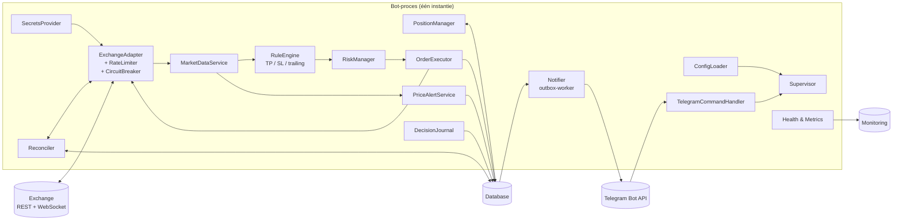
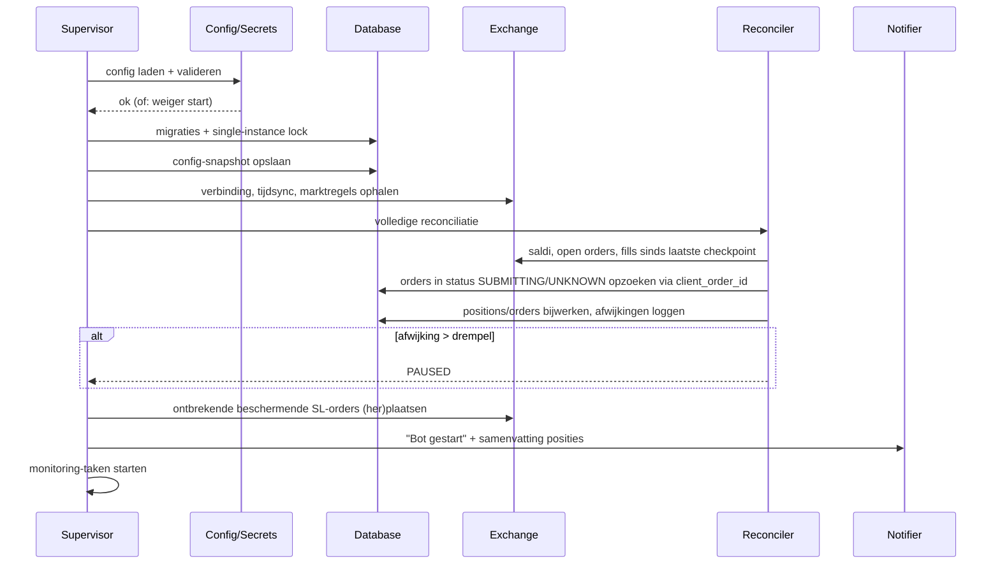
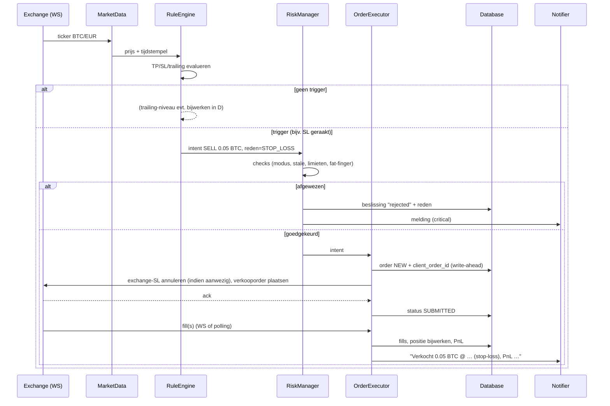
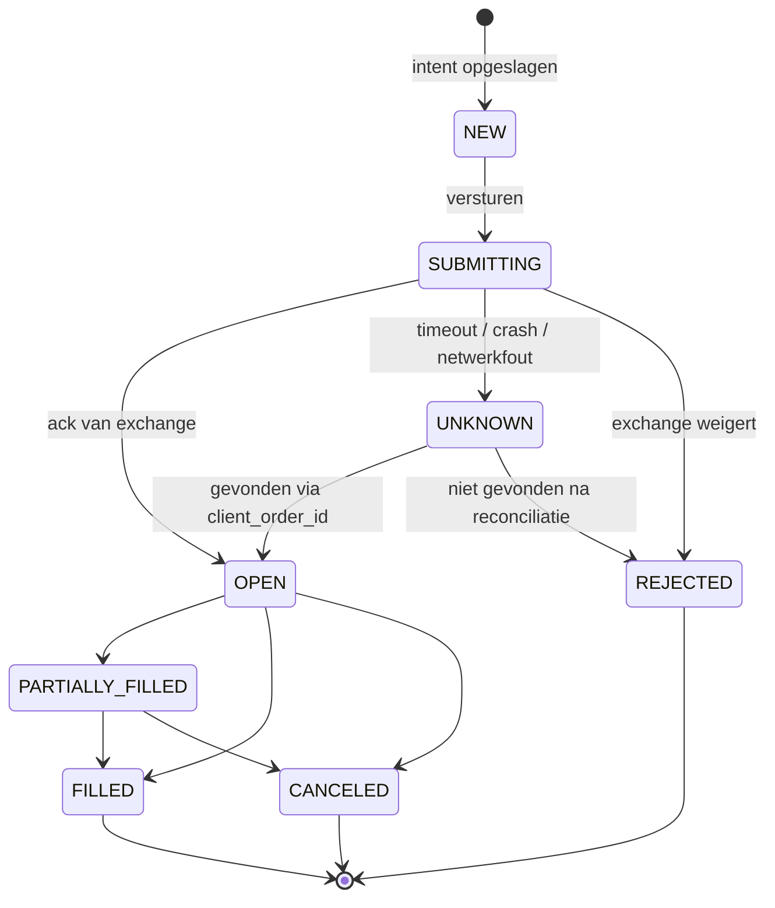
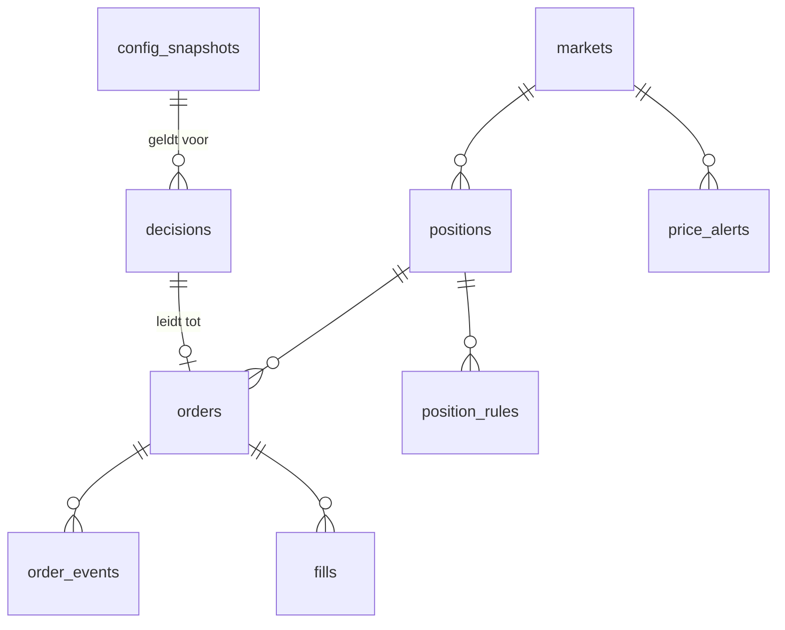

# Crypto Trading Bot — Technische Architectuur

> Status: **ontwerp**. Dit document bevat nog geen implementatie. Het beschrijft
> wat er gebouwd wordt, hoe de onderdelen samenwerken en welke keuzes daarbij
> gemaakt zijn, zodat de implementatie daarna stap voor stap kan volgen.

## 0. Uitgangspunten

| # | Uitgangspunt | Gevolg voor het ontwerp |
|---|---|---|
| 1 | **Kapitaalbehoud gaat vóór winst.** | Bij twijfel doet de bot *niets* en meldt het. Elke onbekende toestand leidt tot "pauze + alarm", nooit tot een gok. |
| 2 | **De bot kan op elk moment crashen.** | Alle toestand staat in de database, niet in het geheugen. Een herstart leest de database en reconcilieert met de exchange. |
| 3 | **De exchange is de bron van waarheid.** | De lokale database is een journaal en cache; bij verschil wint de exchange en wordt het verschil gelogd en gemeld. |
| 4 | **Bescherming mag niet afhangen van de bot.** | Stop-loss wordt waar mogelijk óók als order *op de exchange* geplaatst, zodat een crashende bot of wegvallend internet je niet onbeschermd laat. |
| 5 | **Eén instantie tegelijk.** | Een exclusieve lock voorkomt dat twee draaiende bots dubbel verkopen. |
| 6 | **Alles is uitlegbaar achteraf.** | Elke beslissing (ook "niets doen") wordt vastgelegd met de invoer waarop die gebaseerd was. |
| 7 | **Eerst droog, dan echt.** | Modi `paper` → `testnet` → `live`, gekozen in de configuratie. |

### Scope

**Wel:** posities monitoren, take-profit (TP) en stop-loss (SL) automatisch
uitvoeren, trailing stop (optioneel), Telegram-meldingen, prijsalarmen,
volledige logging, beheer via configuratiebestand, beperkte Telegram-commando's
(status, pauze, noodstop).

**Niet (in v1):** zelfstandig nieuwe posities openen op basis van een strategie,
hefboom/futures/margin, opnames (withdrawals). De bot *beheert* posities die jij
opent; hij verkoopt, hij koopt niet uit zichzelf. Aankopen die jij (handmatig of
via de exchange-app) doet worden wél gedetecteerd, gemeld en onder beheer
genomen. Een strategiemodule is als uitbreidingspunt voorzien (§1, `Strategy`).

### "Eigen wallet": twee varianten

| Variant | Wat de bot krijgt | Aanbevolen? |
|---|---|---|
| **A. Account op een centrale exchange (CEX)** — Binance, Kraken, Bitvavo, Coinbase… | API-sleutel met *alleen* lees- en handelsrechten, **zonder opnamerecht**, gebonden aan het IP-adres van de server. | **Ja, voor v1.** Een gelekte sleutel kan in het ergste geval slecht handelen, maar geen geld weghalen. Exchange-native stop-orders zijn beschikbaar. |
| **B. Self-custody wallet + DEX** — bijv. EVM-wallet met Uniswap | De private key (of een signer die ermee tekent). | Pas later, en dan met een aparte "hot wallet" met beperkt saldo. Een gelekte key = alle fondsen weg. Geen native stop-orders; bot is de enige bescherming. Extra risico's: gas, MEV/sandwich, slippage, reorgs. |

Het ontwerp abstraheert dit achter één `ExchangeAdapter`-interface, zodat
variant B later als extra adapter kan worden toegevoegd zonder de rest te
wijzigen. De rest van dit document gaat uit van variant A.

---

## 1. Componenten

| Component | Verantwoordelijkheid | Belangrijke eigenschappen |
|---|---|---|
| **Supervisor** | Start/stopt alle taken, bewaakt ze, herstart een gecrashte taak met backoff, voert gecontroleerde shutdown uit (SIGTERM). Houdt de globale modus bij: `RUNNING`, `PAUSED`, `HALTED`. | Verwerft bij opstart de single-instance lock. Bij een fatale fout: `HALTED` + melding, geen stille exit. |
| **ConfigLoader** | Leest het configuratiebestand (YAML), valideert tegen een schema, vult defaults in, weigert te starten bij ongeldige of tegenstrijdige waarden. | Slaat bij elke start een snapshot + hash op in de database, zodat elke beslissing te koppelen is aan de config die toen gold. Optioneel: hot-reload van *niet-kritische* velden (meldingsdrempels), kritische velden (keys, modus) alleen bij herstart. |
| **SecretsProvider** | Levert API-sleutels en de Telegram-token. | Bronnen in volgorde: secret manager → versleuteld bestand → omgevingsvariabelen. Secrets staan **nooit** in het configuratiebestand of in git. |
| **ExchangeAdapter** | Enige plek die met de exchange praat. Uniforme interface: saldi, open orders, order plaatsen/annuleren, fills, tickers, WebSocket-streams, marktregels (min. ordergrootte, tick size, step size). | Bevat de **RateLimiter** (token bucket per endpoint-gewicht, afgestemd op de limieten van de exchange, met marge), **retry met exponentiële backoff + jitter** voor veilige (idempotente) calls, en een **CircuitBreaker** die na herhaalde fouten de adapter tijdelijk "open" zet. Implementatiebasis: een bibliotheek als `ccxt`, met een eigen dunne laag erover. |
| **MarketDataService** | Levert actuele prijzen per gevolgde markt. Primair via WebSocket, met REST-polling als fallback. | Houdt per markt de leeftijd van de laatste prijs bij. **Verouderde data (stale) blokkeert beslissingen** in plaats van erop te handelen. Detecteert gaten en herverbindt automatisch. |
| **PositionManager** | Houdt per asset de positie bij: hoeveelheid, gemiddelde instapprijs, TP/SL-niveaus, hoogste prijs sinds instap (voor trailing), status. | Afgeleid uit fills; kostprijsberekening incl. fees. Nieuwe posities (jouw handmatige aankopen) krijgen TP/SL volgens de config-defaults of per-asset overrides. |
| **RuleEngine** | Evalueert bij elke prijsupdate de regels per positie: TP geraakt? SL geraakt? Trailing stop opschuiven? Levert een *voorstel* (intent), voert zelf niets uit. | Puur en deterministisch: zelfde invoer → zelfde uitkomst. Daardoor goed testbaar en achteraf reproduceerbaar. Ondersteunt gedeeltelijke TP (bijv. 50% op +10%, rest op +20%). Uitbreidingspunt: `Strategy`-interface voor latere koop-logica. |
| **RiskManager** | Laatste poortwachter vóór elke order. Weigert als: modus ≠ `RUNNING` (behalve noodverkoop), data stale, orderwaarde boven maximum, dagelijks verlies boven limiet, te veel orders per tijdseenheid, prijs wijkt te ver af van referentie (fat-finger), saldo onvoldoende, marktregels geschonden. | Elke weigering is een gelogde beslissing met reden. Harde limieten die niet via Telegram te wijzigen zijn. |
| **OrderExecutor** | Zet een goedgekeurde intent om in een order. | **Write-ahead**: eerst de intent met een uniek `client_order_id` opslaan, dán versturen. Na een crash tussen opslaan en bevestiging kan de Reconciler via dat ID vaststellen of de order bestaat. Voorkomt dubbele verkopen. Beheert de order-state-machine (§2.4). |
| **Reconciler** | Bij opstart en periodiek (bijv. elke 60 s): vergelijkt saldi, open orders en recente fills op de exchange met de database. Werkt de database bij, markeert afwijkingen. | Bij onverklaarbaar verschil boven drempel: `PAUSED` + melding. Detecteert ook aankopen/verkopen die buiten de bot om gedaan zijn. |
| **PriceAlertService** | Detecteert grote prijsbewegingen: % verandering over een venster (bijv. ±5% in 15 min, ±10% in 24 u), per asset instelbaar. | Cooldown per asset/venster om spam te voorkomen. |
| **Notifier** | Verstuurt meldingen naar Telegram. | Werkt via een **outbox-tabel**: componenten schrijven een melding in de database, een aparte worker verstuurt ze met retries en respecteert de Telegram-limieten. Een haperende Telegram blokkeert zo nooit het handelen, en na een herstart gaan niet-verzonden meldingen alsnog uit. Prioriteiten: `critical` (direct), `trade` (direct), `info` (mag gebundeld worden). |
| **TelegramCommandHandler** | Beperkte set commando's: `/status`, `/positions`, `/pause`, `/resume`, `/kill` (alles verkopen/annuleren + halt), `/setsl`, `/settp`. | Alleen berichten van een **whitelist van chat-ID's** worden verwerkt, de rest wordt genegeerd en gelogd. Gevaarlijke commando's vragen bevestiging met een eenmalige code. Wijzigingen blijven binnen de harde grenzen van de RiskManager. Kan uitgeschakeld worden (read-only modus). |
| **DecisionJournal** | Legt elke evaluatie met gevolg vast: welke regel, welke invoer (prijs, positie, config-hash), welke uitkomst, waarom. | Append-only. Niet elke tick — alleen evaluaties die tot een actie, weigering of statuswijziging leiden, plus periodieke samenvattingen. |
| **Health & Metrics** | HTTP-endpoint met `/health` (liveness), `/ready` (readiness: DB, exchange, data vers) en `/metrics` (Prometheus-formaat). | Verstuurt daarnaast een **heartbeat** naar een externe dead-man's switch (§7). |

### Technologiekeuze (voorstel)

| Onderdeel | Keuze | Waarom |
|---|---|---|
| Taal / runtime | Python 3.11+, `asyncio` | Beste ecosysteem voor exchanges (`ccxt`), eenvoudig, veel WebSocket-streams in één proces. |
| Getallen | `Decimal`, nooit `float` | Afrondingsfouten bij bedragen zijn onacceptabel. Afronding naar tick/step size van de markt. |
| Database | SQLite (WAL-modus) voor één bot; PostgreSQL als je meerdere bots of een dashboard wilt | SQLite: nul beheer, transactioneel, prima voor dit volume. Het schema (§6) werkt op beide. |
| Config | YAML + schemavalidatie (bijv. pydantic) | Leesbaar, commentaar mogelijk, strikte validatie. |
| Telegram | Bot API via HTTPS (long polling, geen inkomende poort nodig) | Geen open poorten op de server. |
| Logging | Gestructureerde JSON-logs naar stdout + roterend bestand | Doorzoekbaar, eenvoudig naar een logplatform te sturen. |

---

## 2. Datastromen

### 2.1 Opstarten en herstel

Belangrijk: de bot start **nooit** direct met handelen. Eerst reconciliatie,
dan controle dat elke positie zijn beschermende orders heeft, dan pas de loop.

### 2.2 Prijsupdate → verkoop (TP/SL)

**Dubbele bescherming.** Per positie staat er een stop-order *op de exchange*
(iets ruimer dan de bot-SL, bijv. 0,5% lager). Normaal triggert de bot eerst
en annuleert hij die order. Ligt de bot plat, dan vangt de exchange-order het
op. Waar de exchange OCO-orders (TP + SL gekoppeld) ondersteunt, kan dat
gebruikt worden. Let op: een order die op de exchange staat, houdt de
hoeveelheid vast; de bot moet eerst annuleren vóór hij zelf verkoopt, en die
volgorde moet crash-veilig zijn (state machine §2.4).

**Ordertype.** Standaard een *marketable limit* (limietprijs = huidige prijs −
maximale slippage uit de config) in plaats van een pure market-order, zodat een
flash crash of dun orderboek niet tot een verkoop tegen elke prijs leidt. Wordt
de order niet (volledig) gevuld binnen X seconden: opnieuw beprijzen tot een
maximaal aantal pogingen, daarna melding.

### 2.3 Aankoop gedetecteerd

Jij koopt handmatig → Reconciler of de fills-stream ziet een nieuwe fill →
PositionManager maakt/actualiseert de positie en herberekent de gemiddelde
instapprijs → TP/SL worden gezet volgens de config → beschermende exchange-SL
wordt geplaatst → Telegram: "Aankoop gedetecteerd: 0.1 ETH @ …, TP …, SL …".

### 2.4 Order-state-machine

`UNKNOWN` is de cruciale toestand: een order waarvan de bot niet zeker weet of
hij bestaat, wordt **nooit** blind opnieuw verstuurd. Eerst opvragen via
`client_order_id`; pas als vaststaat dat hij niet bestaat, mag een nieuwe
poging (met een nieuw ID).

### 2.5 Meldingen

Component → rij in `notifications` (status `pending`) in **dezelfde transactie**
als de gebeurtenis zelf → Notifier-worker haalt pending rijen op → verstuurt
naar Telegram → status `sent` (of `failed` na N pogingen, met een lokale
log-regel en metric). Zo gaat geen melding verloren en wordt er geen melding
verstuurd over iets dat niet is vastgelegd.

### 2.6 Periodieke taken

| Taak | Interval (default) |
|---|---|
| Reconciliatie | 60 s |
| Heartbeat naar dead-man's switch | 60 s |
| Controle beschermende orders aanwezig | 5 min |
| Saldosnapshot | 15 min |
| Dagoverzicht via Telegram (posities, PnL, fouten) | dagelijks, instelbaar tijdstip |
| Opschonen oude ruwe logs / tick-data | dagelijks |
| Database-backup | elk uur + continu (bij Litestream) |

---

## 3. Configuratie

Eén YAML-bestand, onder versiebeheer (zonder secrets). Structuur op hoofdlijnen:

| Sectie | Inhoud |
|---|---|
| `mode` | `paper` \| `testnet` \| `live` |
| `exchange` | naam, quote-valuta (bijv. EUR), eigen rate-limit-marge (bijv. 70% van de exchange-limiet), timeouts, retry-beleid |
| `secrets` | alleen *verwijzingen* (namen van env-vars / secret-IDs), nooit waarden |
| `markets` | lijst van te volgen paren; per paar optionele overrides van onderstaande defaults |
| `defaults.take_profit` | niveaus als % boven instap, met fractie per niveau (bijv. 50% op +8%, 50% op +15%) |
| `defaults.stop_loss` | % onder instap, type `fixed` of `trailing` (met trail-afstand en activatiedrempel) |
| `defaults.exchange_stop_buffer` | extra marge voor de beschermende stop op de exchange |
| `execution` | ordertype, max. slippage, fill-timeout, max. herbeprijzingen |
| `risk` | max. orderwaarde, max. orders per uur, max. dagverlies (→ auto-pause), fat-finger-afwijking, stale-data-drempel (bijv. 15 s), reconciliatie-afwijkingsdrempel |
| `alerts` | vensters en drempels voor prijsbewegingen, cooldown |
| `telegram` | toegestane chat-ID's, commando's aan/uit, bevestiging vereist voor, stille uren (niet voor `critical`) |
| `monitoring` | poort metrics/health, heartbeat-URL (als secret-verwijzing), tijdstip dagoverzicht |
| `storage` | databasepad/URL, bewaartermijnen, backup-instellingen |
| `logging` | niveau, formaat, rotatie |

Validatieregels (voorbeelden): SL moet onder instap liggen; som van TP-fracties
= 100%; exchange-buffer > 0; `live` vereist dat `risk.*` allemaal expliciet
gezet zijn (geen stilzwijgende defaults bij echt geld).

---

## 4. Risico's

### 4.1 Technisch

| Risico | Gevolg | Maatregel |
|---|---|---|
| Bot crasht / server valt uit | Positie zonder bewaking | Exchange-native stop-orders; auto-restart (systemd/Docker); dead-man's switch alarmeert extern. |
| Crash tussen order versturen en bevestiging | Dubbele of ontbrekende verkoop | Write-ahead intent + `client_order_id` + `UNKNOWN`-status + reconciliatie. |
| Twee instanties tegelijk | Dubbele verkopen | Single-instance lock (DB-lock of lockfile), bij deployment maximaal 1 replica. |
| WebSocket valt stil zonder foutmelding | Beslissingen op oude prijs | Stale-detectie per markt; REST-fallback; beslissingen geblokkeerd bij stale data. |
| Rate limit overschreden | Tijdelijke of permanente IP-ban | Token bucket met marge, gewichten per endpoint, respecteren van `Retry-After`, circuit breaker. |
| Klokafwijking | Geweigerde gesigneerde requests | NTP op de host; tijdsync-check met exchange bij opstart en periodiek. |
| Afrondingsfouten | Order geweigerd of verkeerde hoeveelheid | `Decimal`, afronden op marktregels, stofresten ("dust") expliciet afhandelen. |
| Exchange-API wijzigt / onderhoud | Fouten, geen handel | Adapter-laag geïsoleerd; onderhoudsmeldingen → `PAUSED` + melding; versie-pinning van libraries. |
| Database corrupt / schijf vol | Toestand kwijt | WAL-modus, backups, schijfruimte-metric met alarm; herstel mogelijk uit exchange-data via reconciliatie. |
| Bug in regels | Verkeerde verkopen | Pure RuleEngine met unit- en property-tests, backtest op historische data, paper-modus, harde limieten in RiskManager. |

### 4.2 Markt

| Risico | Maatregel |
|---|---|
| **Gap / flash crash**: prijs springt over de SL heen | Een SL garandeert geen prijs. Marketable limit met max. slippage; bij niet-vullen: melding en beslisregel in config (verder verlagen of wachten). Bewust accepteren dat SL-verkopen onder het niveau kunnen uitvallen. |
| **Stop hunting / wicks**: korte piek raakt SL | Optioneel: bevestiging vereisen (prijs X seconden onder SL of slotkoers van een candle) — afweging tegen trager reageren. |
| Dun orderboek bij kleine coins | Max. orderwaarde t.o.v. orderboekdiepte; waarschuwing bij illiquide markten. |
| Fees en spread eten winst op | Fees meenemen in instapprijs en PnL; TP-niveaus boven fees + spread valideren. |

### 4.3 Operationeel en juridisch

- **Misconfiguratie** (bijv. SL op 50% i.p.v. 5%): schemavalidatie, plausibiliteitsgrenzen, bij start een samenvatting van de actieve regels naar Telegram.
- **Exchange-insolventie of account-bevriezing**: buiten het bereik van de bot; niet meer op de exchange houden dan nodig.
- **Belasting en regelgeving**: in Nederland vallen crypto-bezittingen in box 3; de transactielog is ook je administratie. Controleer of de gebruikte exchange een MiCA-vergunning heeft en of geautomatiseerd handelen via de API binnen hun voorwaarden valt.
- **Geen rendementsgarantie**: de bot automatiseert je eigen regels, het verbetert ze niet. Een automatische SL kan ook een verlies vastzetten dat anders hersteld was.

---

## 5. Beveiligingsmaatregelen

### 5.1 Sleutels en secrets
1. **API-sleutel met minimale rechten**: lezen + spot-handel. **Opnames uit**. Geen futures/margin.
2. **IP-whitelist** op de API-sleutel: alleen het (vaste) IP van de server.
3. Aparte **sub-account** op de exchange voor de bot, met alleen het kapitaal dat de bot mag beheren.
4. Secrets in een secret manager, of versleuteld op schijf (bijv. `sops`/`age`), of als env-vars met bestandsrechten `600`. Nooit in config, git, logs, of Telegram-berichten.
5. Sleutelrotatie: periodiek (bijv. elk kwartaal) en direct bij vermoeden van lek. Een procedure beschrijven (runbook) voordat het nodig is.
6. Voor variant B (eigen wallet): aparte hot wallet met beperkt saldo, key in hardware/KMS-signer waar mogelijk, token-approvals beperkt tot exacte bedragen.

### 5.2 Telegram
- Alleen whitelisted chat-ID's; alle andere berichten negeren en loggen (en eventueel melden).
- Gevaarlijke commando's (`/kill`, TP/SL wijzigen) vereisen een bevestigingscode met korte geldigheid.
- Via Telegram kun je nooit de harde risk-limieten, API-sleutels of opname-acties wijzigen; die bestaan simpelweg niet als commando.
- Twee-stapsverificatie op je Telegram-account; de bot-token behandelen als secret.
- Meldingen bevatten geen saldo's van niet-beheerde assets of accountgegevens (beperken wat een meelezer ziet), instelbaar.

### 5.3 Host en proces
- Draaien als niet-root gebruiker; in een container met read-only rootfilesystem en alleen een beschreven volume voor data.
- **Geen inkomende poorten** open naar internet: Telegram via long polling, metrics alleen op localhost of via een VPN (bijv. Tailscale/WireGuard).
- SSH alleen met sleutels, fail2ban, automatische security-updates.
- Dependencies vastgepind met hashes; periodieke audit (bijv. `pip-audit`); geen onbekende packages (supply-chain-risico is reëel bij crypto-bots).
- Uitgaand verkeer indien mogelijk beperken tot de exchange-, Telegram- en monitoring-domeinen.

### 5.4 Data
- Log-redactie: API-sleutels, signatures en tokens worden gemaskeerd vóór het loggen.
- Database en backups versleuteld at rest (schijfversleuteling of versleutelde backup-bestemming).
- Audit-tabellen zijn append-only (geen updates/deletes via de applicatie).

---

## 6. Database-ontwerp

Conventies: alle tijden in UTC (`TIMESTAMP` / ISO-8601), bedragen als
`NUMERIC` (Postgres) of `TEXT` met decimale string (SQLite), nooit float. Primaire
sleutels zijn interne IDs; externe IDs van de exchange apart en uniek.

### Tabellen

**`config_snapshots`** — elke geladen configuratie
`id`, `loaded_at`, `sha256`, `mode`, `content_redacted` (JSON, zonder secrets)

**`markets`** — gevolgde handelsparen en hun regels
`id`, `symbol` (bijv. `BTC/EUR`), `base`, `quote`, `tick_size`, `step_size`, `min_notional`, `active`, `rules_updated_at`

**`positions`** — één rij per (lopende of afgesloten) positie
`id`, `market_id`, `status` (`OPEN`, `CLOSING`, `CLOSED`), `quantity`, `avg_entry_price`, `fees_paid`, `highest_price_since_entry`, `opened_at`, `closed_at`, `realized_pnl`, `source` (`manual`, `bot`, `reconciled`), `version` (optimistische locking)

**`position_rules`** — actieve TP/SL-niveaus per positie
`id`, `position_id`, `kind` (`TP`, `SL`, `TRAILING_SL`), `trigger_price`, `trail_pct`, `fraction`, `status` (`ACTIVE`, `TRIGGERED`, `CANCELED`), `origin` (`config`, `telegram`, `manual`), `created_at`, `updated_at`

**`orders`** — elke order die de bot plaatst of op de exchange aantreft
`id`, `client_order_id` (UNIQUE), `exchange_order_id` (UNIQUE, nullable), `position_id`, `decision_id`, `market_id`, `side`, `type`, `purpose` (`TAKE_PROFIT`, `STOP_LOSS`, `PROTECTIVE_STOP`, `KILL`, `EXTERNAL`), `quantity`, `limit_price`, `stop_price`, `status` (zie §2.4), `filled_quantity`, `avg_fill_price`, `created_at`, `updated_at`, `last_error`

**`order_events`** — append-only geschiedenis van elke statusovergang
`id`, `order_id`, `at`, `from_status`, `to_status`, `raw` (JSON antwoord van de exchange, geredigeerd)

**`fills`** — uitgevoerde transacties (ook handmatige aankopen)
`id`, `exchange_trade_id` (UNIQUE), `order_id` (nullable voor externe trades), `market_id`, `side`, `quantity`, `price`, `fee`, `fee_asset`, `executed_at`

**`decisions`** — het beslissingsjournaal (append-only)
`id`, `at`, `config_snapshot_id`, `position_id`, `rule_id`, `kind` (`TP_TRIGGER`, `SL_TRIGGER`, `TRAIL_MOVE`, `RISK_REJECT`, `PAUSE`, `RESUME`, `KILL`, `RECONCILE_DIFF`, …), `inputs` (JSON: prijs, prijs-tijdstempel, positie, limieten), `outcome` (`EXECUTED`, `REJECTED`, `SKIPPED`), `reason`

**`balance_snapshots`** — periodieke saldi voor audit en reconciliatie
`id`, `at`, `asset`, `free`, `locked`, `source` (`exchange`, `computed`)

**`price_alerts`** — verstuurde bewegingsalarmen (ook voor cooldown)
`id`, `market_id`, `window`, `change_pct`, `price_from`, `price_to`, `triggered_at`

**`notifications`** — outbox voor Telegram
`id`, `created_at`, `priority`, `category` (`BUY`, `SELL`, `ALERT`, `ERROR`, `SYSTEM`, `DAILY`), `body`, `status` (`pending`, `sent`, `failed`), `attempts`, `last_error`, `sent_at`, `dedupe_key` (UNIQUE, voorkomt dubbele meldingen na herstart)

**`system_events`** — starts, stops, crashes, moduswissels, reconnects, circuit-breaker-events
`id`, `at`, `level`, `component`, `event`, `details` (JSON)

**`bot_state`** — kleine key/value-tabel voor globale toestand
`key` (PK), `value`, `updated_at` — o.a. `mode` (`RUNNING`/`PAUSED`/`HALTED`), `instance_lock`, `last_reconciled_fill_at`, `daily_loss_eur`.

### Indexen en bewaartermijnen
- Indexen op `orders(status)`, `orders(position_id)`, `fills(executed_at)`, `decisions(at)`, `notifications(status, priority)`.
- Transacties, fills, orders, beslissingen: **permanent** bewaren (fiscale administratie, minimaal 7 jaar).
- Ruwe tick-data wordt niet in de database opgeslagen (hooguit geaggregeerde candles voor backtests, apart en optioneel).
- Schema-migraties versiebeheerd en automatisch bij opstart.

---

## 7. Monitoring

### 7.1 Drie lagen
1. **Binnen de bot**: health-checks en metrics.
2. **Buiten de bot**: een externe **dead-man's switch** (bijv. Healthchecks.io of Uptime Kuma op een *andere* machine) die alarm slaat als de heartbeat uitblijft. Dit is de enige manier om te merken dat de bot zelf — inclusief de Notifier — dood is.
3. **Jij**: Telegram-meldingen + dagoverzicht.

### 7.2 Metrics (Prometheus-formaat)

| Metric | Alarm bij |
|---|---|
| `bot_mode` (0/1/2) | ≠ RUNNING langer dan X min |
| `market_data_age_seconds{symbol}` | > stale-drempel |
| `ws_reconnects_total` | stijging > N per uur |
| `exchange_request_errors_total{endpoint,code}` | foutpercentage > drempel |
| `rate_limit_utilization_ratio` | > 0,8 |
| `circuit_breaker_open{component}` | = 1 |
| `orders_in_unknown_state` | > 0 langer dan 2 min |
| `positions_without_protective_stop` | > 0 |
| `reconcile_diff_value_eur` | > drempel |
| `notification_outbox_pending` / `…_failed_total` | backlog groeit / failed > 0 |
| `daily_realized_pnl_eur`, `unrealized_pnl_eur` | onder dagverlieslimiet |
| `process_resident_memory_bytes`, schijfruimte | trend / > 85% |
| `last_heartbeat_timestamp` | extern gecontroleerd |

### 7.3 Meldingsniveaus via Telegram

| Niveau | Voorbeelden |
|---|---|
| 🔴 **Critical** (altijd, ook in stille uren) | SL uitgevoerd, order in `UNKNOWN`, positie zonder bescherming, reconciliatie-afwijking, bot `HALTED`, dagverlieslimiet geraakt, onbevoegd Telegram-bericht |
| 🟢 **Trade** | Aankoop gedetecteerd, TP uitgevoerd, trailing stop opgeschoven (optioneel) |
| 🟡 **Alert** | Grote prijsbeweging |
| ℹ️ **Info** | Gestart/gestopt, dagoverzicht, WebSocket-herverbinding (gebundeld) |

### 7.4 Logs
Gestructureerde JSON met vaste velden: `ts`, `level`, `component`, `event`,
`symbol`, `order_id`, `client_order_id`, `decision_id`, `correlation_id`. Via
`correlation_id` is één prijsupdate → beslissing → order → fill → melding
volledig te volgen. Optioneel naar Loki/Grafana, anders lokaal met rotatie.

Optioneel dashboard (Grafana): posities, PnL, orderhistorie, latentie,
foutpercentages.

---

## 8. Deployment-opties

| Optie | Voordelen | Nadelen | Geschikt voor |
|---|---|---|---|
| **1. VPS + Docker Compose** (Hetzner, DigitalOcean, …) | Goedkoop (±€5–10/mnd), vast IP (voor API-whitelist), 24/7, dicht bij de exchange te kiezen, volledige controle | Zelf patchen en beveiligen | **Aanbevolen voor v1** |
| **2. VPS + systemd (zonder Docker)** | Nog eenvoudiger, minder lagen | Minder reproduceerbaar | Als je Docker niet wilt |
| **3. Thuis (Raspberry Pi / NAS)** | Geen maandkosten, fysiek bij jou | Thuisinternet en stroom zijn single points of failure, vaak geen vast IP, SD-kaarten slijten | Alleen voor paper/testnet |
| **4. Managed container** (Fly.io, Railway, Cloud Run met min. 1 instantie) | Weinig beheer, ingebouwde restarts en logs | Vast uitgaand IP vaak betaald/lastig, persistente opslag beperkt, risico op >1 instantie bij deploys | Alleen met Postgres en goede instance-lock |
| **5. Kubernetes** | Schaalbaar | Veel te zwaar voor één bot; replicas >1 zijn gevaarlijk | Niet aanbevolen |

### Aanbevolen opzet (optie 1)
- Eén container `bot` met `restart: unless-stopped`, healthcheck op `/health`, non-root, read-only rootfs, volume voor `/data` (SQLite).
- Optionele containers: `litestream` (continue replicatie van SQLite naar S3-compatibele opslag, versleuteld), `prometheus` + `grafana` (alleen bereikbaar via VPN).
- Dead-man's switch **extern** (niet op dezelfde VPS).
- Deploy: image bouwen in CI met vaste versies → op de server `pull` + herstart. Graceful shutdown: bij SIGTERM geen nieuwe orders, lopende orders afwachten tot een time-out, toestand opslaan. Omdat beschermende stops op de exchange staan, is een korte onderbreking tijdens een deploy veilig.
- Tijdsynchronisatie (chrony/NTP) op de host.

### Uitrolpad
1. **Paper-modus**: echte marktdata, gesimuleerde orders en fills (met fees en slippage-model), alles gelogd en gemeld. Minimaal een paar weken.
2. **Testnet** van de exchange (waar beschikbaar): echte API-flows, nep-geld. Hier crash-tests: proces killen midden in een order, netwerk wegnemen, WebSocket laten verstommen, en verifiëren dat herstel correct is.
3. **Live met klein bedrag** en strikte limieten.
4. Limieten stapsgewijs verruimen.

---

## 9. Teststrategie (samenvatting)

- **Unit**: RuleEngine en RiskManager (puur, deterministisch), afronding op marktregels, PnL-berekening.
- **Property-based**: nooit meer verkopen dan de positie; TP-fracties tellen op tot de positie; SL-niveau schuift alleen omhoog bij trailing.
- **Integratie**: tegen een nep-exchange (in-memory adapter) met instelbare fouten, vertraging en rate limits.
- **Chaos / herstel**: crash op elk punt van de order-state-machine, daarna herstart → geen dubbele of vergeten orders.
- **Backtest**: regels loslaten op historische candles om de parameters te toetsen.

---

## 10. Open vragen voor de volgende stap

1. Welke exchange (of: CEX of self-custody/DEX)?
2. Welke quote-valuta (EUR/USDT) en welke assets?
3. Alleen spot, bevestigd?
4. Vaste stop-loss, trailing, of beide als keuze per asset?
5. Mag de bot in v1 via Telegram ook TP/SL wijzigen, of alleen lezen + pauze/noodstop?
6. Voorkeur voor deployment (VPS / thuis / managed)?

Na beantwoording volgt de implementatie in deze volgorde: configuratie + schema
→ ExchangeAdapter (met nep-adapter voor tests) → database + reconciliatie →
RuleEngine + RiskManager → OrderExecutor → Notifier + Telegram → monitoring →
paper-modus → deployment.
