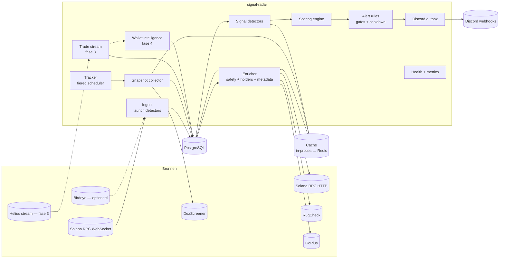
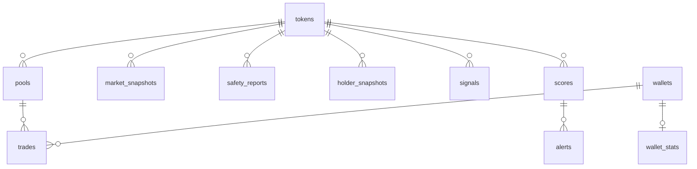
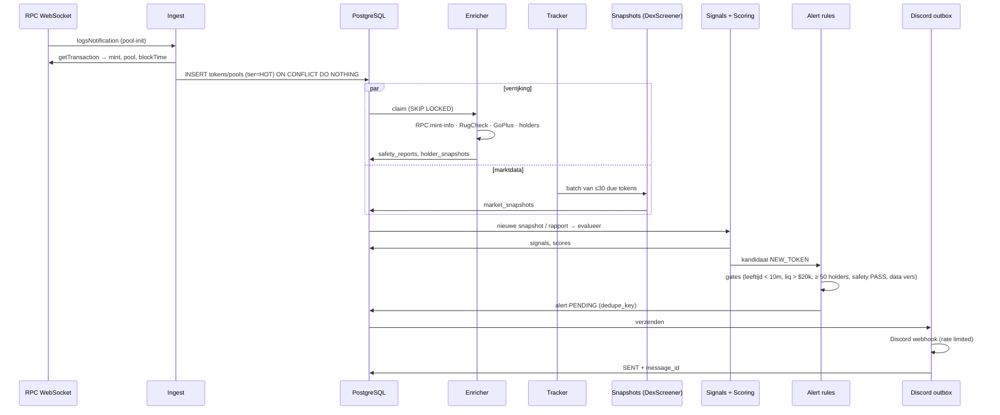

# Signal Radar — Architectuur

> Status: **ontwerp, nog geen implementatie.**
> Doel: nieuwe tokens vroeg detecteren en **objectieve, meetbare** afwijkende
> marktactiviteit signaleren via Discord.

## 0. Uitgangspunten

| # | Principe | Gevolg |
|---|---|---|
| 1 | **Meten, niet voorspellen.** | Elk signaal is een reproduceerbare meting met drempel en bewijs (waarde, referentie, tijdvenster, bron). Geen "koop", "moon", "pump" of koersdoelen. Elke alert draagt een vaste disclaimer. |
| 2 | **Transparant scoren.** | De Signal Score is een optelsom van benoemde componenten met vaste gewichten uit een geversioneerd configuratiebestand. Elke alert toont de opbouw. De score meet *hoe uitzonderlijk de activiteit is*, niet de kans op een koersstijging. |
| 3 | **Ontbrekende data is nooit "geslaagd".** | Een check zonder data heet `UNKNOWN`, telt niet mee in de score en wordt in de alert vermeld. |
| 4 | **Providers zijn vervangbaar.** | Alle externe data loopt via interfaces (§E). Geen enkele module buiten `providers/` kent een URL of een veldnaam van een provider. |
| 5 | **Read-only.** | De bot handelt niet, heeft geen wallet en geen private keys. Dat haalt de grootste beveiligingsrisico's weg. |
| 6 | **Eerst één chain goed.** | Fase 1–4: Solana. Het datamodel heeft vanaf dag 1 een `chain`-kolom, zodat EVM-chains (Base, BSC) later een extra provider-set zijn in plaats van een herbouw. |
| 7 | **Signalen zijn manipuleerbaar.** | Volume, holders en "whales" kunnen nep zijn (wash trading, gebundelde aankopen, sybil-wallets). Het ontwerp meet dit waar het kan (§G.5) en zegt het eerlijk in de alerts. |

---

## A. Systeemarchitectuur



### Componenten

| Component | Verantwoordelijkheid |
|---|---|
| **Ingest** | Detecteert nieuwe pools/tokens via launch-bronnen (primair: on-chain `logsSubscribe` op DEX-programma's). Schrijft `tokens` + `pools` idempotent (`ON CONFLICT DO NOTHING`). Legt de **on-chain aanmaaktijd** vast (blockTime van de aanmaaktransactie): dat is de bron voor *tokenleeftijd*. |
| **Enricher** | Haalt eenmalig en daarna periodiek op: metadata (naam, symbool, decimals, supply), mint/freeze authority, veiligheidsrapporten (RugCheck, GoPlus), holders en top-10-concentratie. |
| **Tracker** | Beheert de monitoringlevenscyclus per token in **tiers** (§F.3) en bepaalt wanneer een snapshot nodig is. Tokens die "dood" zijn (liquiditeit weg, geen transacties) worden gearchiveerd. |
| **Snapshot collector** | Haalt marktdata op in batches (DexScreener accepteert meerdere adressen per request) en schrijft `market_snapshots`. |
| **Trade stream** (fase 3) | Individuele swaps per pool, nodig voor unieke kopers, koop/verkoopvolume en whale-trades. |
| **Signal detectors** | Pure functies: `(huidige snapshot, historie, config) → Signal | None`. Eén module per signaaltype. |
| **Scoring engine** | Combineert signalen tot een Signal Score met componentenopbouw en een betrouwbaarheidsgraad (hoeveel data er was). |
| **Alert rules** | Beslist of er een alert uitgaat: gates (veiligheid, versheid, leeftijd), drempels, cooldowns, escalatie, globale alertlimiet. |
| **Discord outbox** | Alerts worden eerst in de database gezet en daarna door een sender verstuurd met retries en per-webhook rate limiting. |
| **Wallet intelligence** (fase 4) | Berekent historische performance van wallets uit eigen verzamelde trades en houdt een watchlist bij. |
| **Health + metrics** | `/health`, `/ready`, `/metrics` (Prometheus). |

**Procesmodel.** Fase 1 is **één proces** met asyncio-taken per component
(eenvoudig, genoeg voor honderden tokens tegelijk). De componenten praten via
de database (work queues met `FOR UPDATE SKIP LOCKED`), niet via
in-memory calls. Daardoor kunnen ze in fase 2+ zonder herontwerp als losse
containers draaien (`ingest`, `tracker`, `signals`, `notifier`).

---

## B. Tech stack

| Laag | Keuze | Waarom |
|---|---|---|
| Taal | **Python 3.12**, `asyncio` | I/O-gebonden werk met veel gelijktijdige verbindingen; sterk ecosysteem voor Solana (`solders`); sluit aan op de bestaande `solana-sniper`-code (detector, tx-parsing en rate limiter zijn herbruikbaar). |
| HTTP | `httpx` (async, HTTP/2) | Connection pooling, timeouts per request. |
| WebSocket | `websockets` | Bewezen in de sniper-bot. |
| Validatie | `pydantic` v2 | Elk provider-antwoord wordt gevalideerd tegen een model; schemawijzigingen worden direct zichtbaar in plaats van stille fouten. |
| Config | YAML + pydantic; secrets via env | Zelfde patroon als de sniper-bot. Scoringconfig in een apart, geversioneerd bestand. |
| Database | **PostgreSQL 16** | Transactioneel, JSONB voor bewijs en ruwe rapporten, native range partitioning voor tijdreeksen. TimescaleDB is een optie als volumes groeien, geen vereiste. |
| DB-driver | `asyncpg` | Snel; geen ORM nodig voor dit schema. |
| Migraties | Genummerde SQL-bestanden + `schema_migrations` | Transparant, geen extra tooling. |
| Cache | Fase 1: in-proces TTL-cache. Fase 2+: **Redis 7** | Redis pas wanneer er meerdere processen zijn die cache en cooldowns moeten delen. |
| Metrics | `prometheus-client` + Grafana | Standaard. |
| Logging | stdlib `logging` met JSON-formatter | Zoals in de sniper-bot. |
| Tests | `pytest`, `pytest-asyncio`, `respx` (HTTP-mocks) | Contracttests draaien tegen *opgenomen* echte provider-antwoorden. |
| Kwaliteit | `ruff`, `mypy --strict` op `core/`, `signals/` en `scoring/` | De rekenkern moet typeveilig zijn. |
| Deployment | Docker Compose op een Linux-VPS | Postgres (en later Redis) op het interne netwerk. |

---

## C. Folderstructuur

```
signal-radar/
├── README.md
├── pyproject.toml
├── Dockerfile
├── docker-compose.yml
├── .env.example
├── config/
│   ├── config.example.yaml          # providers, limieten, tiers, alertregels
│   └── scoring.v1.yaml              # gewichten + normalisatiedrempels (geversioneerd)
├── migrations/
│   └── 0001_init.sql
├── docs/
│   ├── ARCHITECTURE.md              # dit document
│   ├── PROVIDERS.md                 # per provider: endpoints, status, limieten, veldmapping
│   └── SIGNALS.md                   # exacte definitie van elk signaal
├── src/radar/
│   ├── __main__.py
│   ├── app.py                       # supervisor: start/stop taken, graceful shutdown
│   ├── settings.py
│   ├── core/                        # domein, geen I/O
│   │   ├── models.py                # Token, Pool, MarketSnapshot, SafetyReport, HolderSnapshot, Trade, Signal, Score, Alert
│   │   └── errors.py                # fouttaxonomie (§J)
│   ├── infra/
│   │   ├── db.py                    # pool, migraties, instance lock
│   │   ├── repositories.py          # alle SQL
│   │   ├── cache.py                 # TTL-cache + single-flight
│   │   ├── ratelimit.py             # token buckets, prioriteiten, AIMD
│   │   ├── circuit.py               # circuit breaker
│   │   ├── http.py                  # gedeelde client, retries, Retry-After
│   │   ├── logging.py
│   │   └── metrics.py
│   ├── providers/
│   │   ├── base.py                  # interfaces (Protocols) + capabilities
│   │   ├── registry.py              # keuze + fallback per capability
│   │   ├── solana_rpc/              # client, launches (logsSubscribe), holders, txparse
│   │   ├── dexscreener.py
│   │   ├── rugcheck.py
│   │   ├── goplus.py
│   │   ├── birdeye.py               # fase 2, optioneel
│   │   └── helius_stream.py         # fase 3
│   ├── pipeline/
│   │   ├── ingest.py
│   │   ├── enrich.py
│   │   └── tracker.py               # tiers + snapshot-scheduling
│   ├── signals/
│   │   ├── base.py                  # Signal-type, venster-helpers
│   │   ├── market.py                # volume spike, tx-groei, mcap-verandering, liquidity growth
│   │   ├── safety.py                # veiligheidsgate uit meerdere rapporten
│   │   ├── holders.py               # holdergroei, concentratie (fase 2)
│   │   ├── flow.py                  # kopers/verkopers, unieke kopers (fase 3)
│   │   ├── whales.py                # fase 3
│   │   └── smart_wallets.py         # fase 4
│   ├── scoring/
│   │   └── engine.py
│   ├── alerts/
│   │   ├── rules.py                 # NEW_TOKEN, MOMENTUM, LIQUIDITY_DROP; cooldown/escalatie
│   │   ├── formatter.py             # Discord-embeds, sanitizing
│   │   └── discord.py               # outbox-sender
│   ├── wallets/                     # fase 4
│   │   └── performance.py
│   └── api/
│       └── health.py
└── tests/
    ├── unit/
    ├── contract/                    # mappers tegen opgenomen provider-antwoorden
    ├── integration/                 # met echte PostgreSQL
    └── fixtures/providers/<provider>/*.json
```

---

## D. Databaseschema

Conventies: elke entiteit heeft `chain`; tijden `timestamptz` (UTC);
USD-bedragen `numeric`; ruwe tokenhoeveelheden `numeric(40,0)`; tijdreeksen
per dag gepartitioneerd.



| Tabel | Belangrijkste kolommen | Opmerkingen |
|---|---|---|
| **tokens** | `chain, address` (PK) · `symbol, name, decimals, supply` · `created_at_chain` (blockTime aanmaak) · `detected_at` · `detection_source, detection_ref` · `creator` · `tier` (`HOT/WARM/COOL/ARCHIVED`) · `next_snapshot_at` · `archived_reason` | `created_at_chain − detected_at` = detectielatentie (metric). Index op `(tier, next_snapshot_at)` voor de tracker. |
| **pools** | `chain, address` (PK) · `token_address, quote_address, dex, program_id` · `created_at_chain` · `first_seen_at` | Een token kan meerdere pools hebben; signalen gebruiken standaard de pool met de meeste liquiditeit. |
| **market_snapshots** *(partitioned)* | `chain, token_address, pool_address, observed_at, source` · `price_usd, liquidity_usd, fdv_usd, market_cap_usd` · `volume_m5, volume_h1, volume_h6, volume_h24` · `buys_m5, sells_m5, buys_h1, sells_h1` · `price_change_m5, price_change_h1` · `provider_updated_at` | PK `(chain, token_address, observed_at)`. `source` maakt vergelijking tussen providers mogelijk. |
| **safety_reports** | `id` · `chain, token_address, provider, checked_at` · `verdict` (`PASS/WARN/FAIL/UNKNOWN`) · `flags jsonb` (genormaliseerde vlaggen) · `provider_score` · `raw jsonb` | Laatste rapport per provider via `DISTINCT ON`. `raw` blijft bewaard, zodat een mapperfout later te herstellen is. |
| **holder_snapshots** | `chain, token_address, observed_at` · `holder_count, holder_count_capped` · `top10_pct` · `method` (`rpc_gpa/das/provider`) · `top_holders jsonb` | `top_holders` (top 20 met eigenaar) is ook nodig voor whale-accumulatie in fase 2. |
| **trades** *(fase 3, partitioned)* | `chain, signature, ix_index` (PK) · `pool_address, token_address, wallet` · `side` · `amount_token, amount_quote, value_usd` · `slot, block_time` | Bron voor unieke kopers, koop/verkoopvolume, whales en wallet-performance. |
| **wallets** / **wallet_stats** *(fase 4)* | `chain, address` · `first_seen_at, labels[]` (bijv. `mev`, `bot`, `cex`, `dev`) · stats: `window, trades, closed_positions, realized_pnl_usd, win_rate, median_hold_s, max_drawdown, computed_at, method_version` | Stats zijn altijd herleidbaar tot `trades`. |
| **wallet_watchlist** *(fase 4)* | `chain, address, reason, added_by, added_at, active` | Handmatig of via reproduceerbare selectiecriteria (§G.4). |
| **signals** | `id` · `chain, token_address, type` · `detected_at, window` · `value, baseline, threshold, ratio` · `evidence jsonb` (snapshot-IDs, bronnen, versheid) · `detector_version` | Append-only. |
| **scores** | `id` · `chain, token_address, computed_at` · `score` · `confidence` · `scoring_version` · `components jsonb` · `gates jsonb` · `penalties jsonb` | Elke score is volledig reproduceerbaar uit `components` + versie. |
| **alerts** | `id` · `chain, token_address, type, score_id` · `created_at` · `dedupe_key` (UNIQUE) · `status` (`PENDING/SENT/FAILED/SUPPRESSED`) · `suppressed_reason` · `payload jsonb` · `discord_message_id, attempts, last_error, sent_at` | Is tegelijk de outbox. Onderdrukte alerts worden ook vastgelegd (analyse van alertmoeheid). |
| **provider_errors** | `id, provider, endpoint, at, kind, message, payload_sample` | Quarantaine voor schemafouten en onverwachte antwoorden. |
| **system_state** | `key, value, updated_at` | Pauzes, laatste verwerkte slot, e.d. |

**Retentie.** `market_snapshots` op volle resolutie 30 dagen, daarna
geaggregeerd naar 5-minuten-candles (voor backtests). `trades` 30 dagen
(korter als het volume te groot wordt; aggregaten blijven). `signals`,
`scores` en `alerts` permanent: dat is de audit trail en de dataset voor
kalibratie. Oude partities worden in zijn geheel gedropt (goedkoop).

---

## E. API- en dataproviders

**Legenda:**
- ✅ Endpoint staat in de officiële documentatie (gecontroleerd op 27-09-2026 via de docs, nog niet live aangeroepen).
- ⚠️ Onzeker of veranderlijk: eerst verifiëren met een contracttest op een opgenomen antwoord.
- ❌ Geen officiële API; niet gebruiken.

**Veldnamen** van responses worden in fase 1 per provider vastgelegd via
*opgenomen echte antwoorden* (`tests/fixtures`). Mappers worden pas
geschreven tegen die fixtures, niet tegen aannames.

| Provider | Wat we gebruiken | Status | Auth / limieten | Rol |
|---|---|---|---|---|
| **Solana JSON-RPC** (elke provider) | `logsSubscribe` (WS), `getTransaction`, `getAccountInfo` (jsonParsed), `getTokenLargestAccounts`, `getMultipleAccounts`, `getProgramAccounts` | ✅ Standaard Solana-RPC-spec | Afhankelijk van de RPC-provider. Publieke endpoints zijn ongeschikt (throttling, `getProgramAccounts` vaak geblokkeerd). | Launch-detectie, tokenleeftijd, authorities, holders, top-10 |
| **Helius** | DAS `getTokenAccounts` (holders); Enhanced WebSockets `transactionSubscribe`; LaserStream gRPC | ✅ Gedocumenteerd, maar ⚠️ beschikbaarheid per abonnement is in 2026 gewijzigd (Enhanced WSS op Developer-plannen sinds april 2026, gRPC op Business). Opnieuw checken bij aanschaf. | API-key; credits | Holders op schaal (fase 2), trade stream (fase 3) |
| **DexScreener** | `GET /tokens/v1/{chainId}/{tokenAddresses}` (meerdere adressen, komma-gescheiden), `GET /token-pairs/v1/{chainId}/{tokenAddress}`, `GET /latest/dex/pairs/{chainId}/{pairId}` | ✅ in API-reference. ⚠️ Max. aantal adressen per request (in de praktijk 30) en exacte veldnamen (`txns.m5.buys`, `volume.m5`, `liquidity.usd`, `marketCap`, `fdv`, `pairCreatedAt`) bevestigen via fixture. | Geen key. 300 req/min (pairs/tokens/search), 60 req/min (profiles/boosts). ⚠️ Gebruiksvoorwaarden checken voor (semi-)commercieel gebruik. | Primaire marktdata: prijs, liquiditeit, FDV/mcap, volume en txn-tellingen per venster |
| DexScreener `token-profiles/latest/v1` | — | ✅ bestaat, maar bevat alleen tokens met een (betaald) profiel | 60/min | **Geen** launch-bron (selectief). Hooguit een metadata-verrijking. |
| **RugCheck** | `GET /v1/tokens/{mint}/report/summary`, `GET /v1/tokens/{mint}/report`, `GET /v1/stats/new_tokens` | ✅ in Swagger (`api.rugcheck.xyz/swagger`). ⚠️ Rate limits niet publiek gedocumenteerd; sommige endpoints vereisen een JWT of API-key. | Conservatief beginnen (1 req/s), bijstellen op basis van 429's | Veiligheid (Solana-only): risico's met niveaus, LP-status, score. `stats/new_tokens` als *secundaire* launch-bron. |
| **GoPlus** | `GET /api/v1/solana/token_security?contract_addresses=…` (Solana); `GET /api/v1/token_security/{chain_id}` (EVM, latere fase) | ✅ gedocumenteerd, maar ⚠️ Solana-API heet officieel **beta**. Veldnamen en limieten van het gratis niveau verifiëren. | Gratis niveau met limieten; key voor hogere quota | Tweede, onafhankelijke veiligheidsbron: mint/freeze/transfer-fee, holders, DEX-info |
| **Birdeye** (optioneel) | `GET /defi/v2/tokens/new_listing`; WS `SUBSCRIBE_TOKEN_NEW_LISTING`; token overview/security/trades | ✅ gedocumenteerd. ⚠️ Toegang per endpoint hangt af van het pakket ("Data Accessibility by Packages"). | API-key, betaald | Fallback-launch-bron + fallback-marktdata. Niet in fase 1. |
| **Jupiter** (optioneel) | Quote API (verhandelbaarheid, round-trip-check) | ⚠️ Base-URL en versie zijn in het verleden gewijzigd (`lite-api.jup.ag` vs `api.jup.ag` + key) | Key voor hogere limieten | Honeypot-achtige check "kun je verkopen" (fase 2) |
| **Discord** | Webhook "Execute Webhook" (`POST /api/webhooks/{id}/{token}`) met embeds en `allowed_mentions` | ✅ officiële API | ±30 berichten/min per webhook; 5 req/5 s per kanaal (gedeeld tussen webhooks); `X-RateLimit-*`- en `Retry-After`-headers | Alerts (en een apart ops-kanaal) |
| pump.fun frontend-API's | — | ❌ geen officiële publieke API | — | Niet gebruiken. Pump.fun-lanceringen alleen on-chain via programmalogs. |

### Abstractielaag

```text
interface LaunchSource          -> stream[LaunchEvent(chain, token, pool, dex, created_at_chain, ref)]
interface MarketDataProvider    -> snapshots(tokens[]) -> {token: MarketSnapshot}   (batchgrootte = capability)
interface SafetyProvider        -> report(token) -> SafetyReport(verdict, flags{…}, provider_score, raw)
interface HolderProvider        -> holders(token) -> HolderSnapshot(count, capped, top_holders[])
interface TradeStreamProvider   -> stream[Trade]                                       (fase 3)
interface WalletHistoryProvider -> trades(wallet, since) -> Trade[]                    (fase 4)
interface AlertSink             -> send(Alert) -> message_id
```

- Elke provider declareert **capabilities** (`batch_size`, `chains`,
  `has_m5_volume`, `has_unique_buyers` …) en een **status** (`verified`,
  `beta`, `unverified`) uit config. De `registry` kiest per capability een
  primaire provider plus fallbacks.
- Alle domeinmodellen (`core/models.py`) zijn provider-neutraal. Mappers
  (`provider → domein`) zijn de enige plek die providervelden kent en hebben
  elk een contracttest.
- **Genormaliseerde veiligheidsvlaggen** (vaste namen, los van de provider):
  `mint_authority_active`, `freeze_authority_active`, `transfer_fee`,
  `transfer_hook`, `permanent_delegate`, `lp_unlocked`,
  `top_holder_concentration`, `metadata_mutable`, `provider_danger:<naam>`.
  Elke vlag is `true`, `false` of `unknown`.
- On-chain feiten (authorities, extensies) worden **zelf** via RPC gelezen.
  RugCheck en GoPlus zijn een aanvulling, geen single point of truth. Bij een
  tegenstrijdigheid wint de on-chain lezing en wordt de afwijking gelogd.

---

## F. Event- en dataflow

### F.1 Van lancering tot NEW TOKEN ALERT



### F.2 MOMENTUM

Elke nieuwe `market_snapshot` triggert een evaluatie van de marktsignalen
voor dat token (§G.2). Signalen worden opgeslagen. De scoring berekent een
nieuwe score. De alertregels beslissen op basis van drempel, minimum aantal
actieve componenten, cooldown en escalatie.

### F.3 Monitoring-tiers

| Tier | Leeftijd token | Snapshot-interval | Holders | Safety-hercheck |
|---|---|---|---|---|
| HOT | 0–15 min | 15 s | elke 60 s | 2 min, 10 min |
| WARM | 15–60 min | 60 s | elke 5 min | elk 30 min |
| COOL | 1–6 u | 5 min | elke 30 min | elk uur |
| ARCHIVED | > 6 u, óf liquiditeit < $1.000 gedurende 15 min, óf 30 min geen transacties | — | — | — |

Een actief MOMENTUM-signaal kan een token terugzetten naar HOT, maximaal 2 uur.

**Capaciteit.** DexScreener: 300 req/min × 30 tokens/request = 9.000
token-updates/min theoretisch. Met 50% veiligheidsmarge en HOT-intervallen
van 15 s zijn dat ongeveer 1.100 HOT-tokens tegelijk. Dat is ruim, omdat alleen
tokens die de minimale liquiditeitsdrempel halen HOT blijven; pools zonder
betekenisvolle liquiditeit gaan na 2 checks naar COOL.

### F.4 Herstart

Alle toestand staat in PostgreSQL (tiers, `next_snapshot_at`, outbox). Na een
herstart gaan de taken verder waar ze waren. De enige tijdelijke toestand is
de WebSocket-subscriptie. Lanceringen tijdens downtime worden bij herstart
ingehaald via RugCheck `stats/new_tokens` (⚠️) en/of Birdeye `new_listing`, en
als laatste redmiddel via `getSignaturesForAddress` op de DEX-programma's
sinds het laatst verwerkte slot.

---

## G. Scoring-architectuur

### G.1 Opbouw

```
score = clamp( Σ_i  w_i · s_i  −  Σ_j p_j , 0, 100 )
```

- `s_i ∈ [0,1]`: genormaliseerde sterkte van component *i*, **stuksgewijs
  lineair** tussen `floor` (0) en `full` (1) uit `scoring.vN.yaml`. Geen
  machine learning en geen verborgen factoren.
- `w_i`: gewicht, samen 100.
- `p_j`: expliciete aftrekposten (bijv. safety `WARN`, hoge concentratie).
- **Gates** zijn geen score. Faalt een gate, dan komt er geen alert (de score
  wordt wel opgeslagen, met reden).
- **Confidence** = som van de gewichten van componenten *met* data ÷ 100.
  Onder de `min_confidence` (standaard 0,7) geen alert, of alleen met het
  label "onvolledige data".
- `scoring_version` wordt bij elke score opgeslagen. Een nieuwe versie is een
  nieuw bestand, zodat oude alerts reproduceerbaar blijven.

### G.2 Signaaldefinities (fase 1–2)

Alle vensters zijn niet-overlappend. Een "baseline" is altijd expliciet.

| Signaal | Definitie | Minimum om ruis te vermijden |
|---|---|---|
| **volume_spike** | `ratio = vol_m5(now) / baseline_5m`. Baseline = volume in het vorige, niet-overlappende 5-minutenvenster (snapshot van ≥ 5 min geleden). Fallback: `(vol_h1 − vol_m5) / ((min(age, 60 min) − 5 min) / 5 min)`. | `vol_m5 ≥ $5.000` en baseline ≥ `$500` (anders is ×10 van $50 betekenisloos) |
| **tx_growth** | `(buys+sells)_m5(now) / (buys+sells)_m5(prev)` | ≥ 30 transacties in het huidige venster |
| **mcap_change** | `Δ% market cap` over 5 m en 15 m. Market cap = prijs × circulerende supply volgens de provider; ontbreekt die, dan FDV (**label vermeldt welke**). | Liquiditeit ≥ gate |
| **liquidity_growth** | `Δ% liquidity_usd` over 5 m en 15 m | Absolute groei ≥ $5.000 |
| **buy_count_ratio** | `buys_m5 / (buys_m5 + sells_m5)`. Alleen **aantallen**; volumeverdeling komt in fase 3. | ≥ 30 transacties |
| **holder_growth** (fase 2) | Δ holders per 5 m, en Δ% t.o.v. vorige meting | ≥ 50 holders |
| **unique_buyers_growth** (fase 3) | Distinct kopende wallets per 5 m venster vs vorig venster, **na uitsluiting** van gelabelde bots/MEV | Uit de trade stream |
| **buy_volume_ratio** (fase 3) | Koopvolume / totaal volume per venster | Uit de trade stream |
| **whale_activity** (fase 2/3) | Fase 2: een top-20-holder (niet pool/PDA/burn) wint ≥ X% van de supply tussen twee holdersnapshots. Fase 3: één trade ≥ max($Y, Z% van de liquiditeit). | Pools, programma-accounts (off-curve) en bekende CEX-/bridge-adressen uitgesloten |
| **smart_wallet_activity** (fase 4) | Een wallet uit de watchlist koopt dit token; toont de gemeten historie van die wallet | Zie §G.4 |

### G.3 Scoring v1 (fase 1, alleen DexScreener- en holderdata)

| Component | Gewicht | floor → full |
|---|---|---|
| volume_spike | 25 | 2× → 8× |
| tx_growth | 15 | 1,5× → 5× |
| liquidity_growth (15 m) | 20 | +10% → +100% |
| mcap_change (15 m) | 15 | +20% → +200% |
| buy_count_ratio | 10 | 0,55 → 0,75 |
| holder_growth | 15 | +10/5 m → +100/5 m |
| **Aftrek** | | safety `WARN` −10 · top-10 ≥ 40% −15 · liquiditeit daalt > 20% in 5 m −20 |

Deze getallen zijn **startwaarden** en geen gekalibreerde waarheid. Fase 5
(backtest) meet op historische data hoe vaak elke drempel afgaat (alertvolume)
en hoe vaak alerts binnen korte tijd gevolgd werden door een liquiditeitsval
(rug-indicator). Dat is kalibratie op datakwaliteit en ruis, niet op
koersvoorspelling.

### G.4 "Aantoonbaar goede" wallets (fase 4)

Alleen berekend uit **eigen verzamelde, controleerbare trades**:

- Een positie = gematchte kopen en verkopen van één token (FIFO). Een
  positie die nog open staat telt niet als winst.
- Metrics per venster (30/90 dagen): aantal gesloten posities, gerealiseerde
  PnL, win rate, mediaan houdtijd, maximale drawdown.
- **Toelating tot de watchlist**: ≥ 20 gesloten posities in 90 dagen, positieve
  gerealiseerde PnL in minstens 2 van de 3 maanden, en geen label `mev/bot/dev`.
  De ondergrens van het 90%-betrouwbaarheidsinterval van de win rate moet
  > 50% zijn (Wilson), zodat een paar gelukstreffers niet volstaan.
- De alert toont de cijfers en de steekproefgrootte, nooit "top trader".
  Goede prestaties in het verleden voorspellen niets; dat staat erbij.

### G.5 Integriteitssignalen (aftrek of waarschuwing)

- **Gebundelde lancering**: veel aankopen in hetzelfde slot als de pool-creatie (fase 3).
- **Wash trading**: veel volume met weinig unieke wallets of heen-en-weer-trades (fase 3).
- **Sybil-holders**: veel holders die vanuit dezelfde wallet gefund zijn (fase 4).

Deze staan zichtbaar in de alert ("⚠️ 62% van het volume komt van 3 wallets").

### G.6 Alertregels

| Alert | Gates | Trigger |
|---|---|---|
| **NEW_TOKEN** | leeftijd < 10 min (op basis van `created_at_chain`) · liquiditeit > $20.000 · ≥ 50 holders · safety = PASS (on-chain + ≥ 1 externe provider, geen `FAIL`) · marktdata < 60 s oud | Eén keer per token |
| **MOMENTUM** | safety geen `FAIL` · liquiditeit ≥ $20.000 · confidence ≥ 0,7 · data vers | score ≥ 60 **en** ≥ 3 componenten met `s_i ≥ 0,5` |
| **LIQUIDITY_DROP** (waarschuwing) | het token had eerder een alert | liquiditeit −50% binnen 5 min |

- **Cooldown**: per token per type 15 min. Binnen de cooldown alleen
  **escalatie** als de score ≥ 15 punten hoger is.
- **Globale limiet**: max. N alerts per uur (config). Daarboven gaan alleen
  de hoogste scores uit; de rest krijgt `SUPPRESSED` met een reden.

---

## H. Cachingstrategie

| Data | Cache | TTL | Reden |
|---|---|---|---|
| Tokenmetadata (naam, decimals, supply) | in-proces LRU (fase 2: Redis) | 24 u | Verandert zelden |
| On-chain authorities en extensies | LRU | 10 min | Kan veranderen (authority opnieuw gezet) → periodieke hercheck volgens tier |
| Safety-rapporten | DB + LRU | volgens tier (2 min → 1 u) | Duur en gelimiteerd |
| Holders / top-10 | DB | volgens tier | Zwaarste RPC-call |
| Marktsnapshots | niet cachen buiten de poll | — | Versheid is het product |
| SOL/USD en andere quote-prijzen | LRU | 30 s | Wordt overal gebruikt |
| 404 / "nog niet geïndexeerd" | negatieve cache | 20 s, oplopend tot 2 min | Indexers lopen achter op nieuwe tokens. Voorkomt hameren zonder de token op te geven. |

- **Single-flight**: gelijktijdige verzoeken voor dezelfde sleutel delen één
  uitgaand request.
- **Stale-while-revalidate** alleen voor metadata, nooit voor marktdata of safety.
- De cache is een optimalisatie: bij een cache-miss of Redis-uitval werkt alles
  (trager) door vanuit DB en provider.

---

## I. Rate-limit-strategie

1. **Token bucket per provider én per endpoint-groep** (DexScreener: pairs/tokens
   300/min, profiles 60/min). Standaard op **50–70%** van de gedocumenteerde
   limiet; voor ongedocumenteerde limieten (RugCheck ⚠️) beginnen op 1 req/s.
2. **Prioriteitswachtrijen** per provider: `P0` HOT-snapshots, `P1`
   gate-checks voor NEW_TOKEN, `P2` WARM/COOL, `P3` backfill/hercheck. Een
   lagere prioriteit kan een hogere nooit vertragen.
3. **Batching**: DexScreener-tokens in groepen van ≤ 30; RPC via
   `getMultipleAccounts` (≤ 100).
4. **Adaptief (AIMD)**: bij een 429 wordt `Retry-After` of
   `X-RateLimit-Reset-After` gerespecteerd en het tempo gehalveerd; na 5 min
   zonder 429's weer +10%.
5. **Budget-metrics**: `requests_used / budget` per provider per minuut, met een
   alarm bij > 85%.
6. **Discord**: aparte bucket per webhook (≤ 25/min) én per kanaal (≤ 4 per 5 s).
   Bij een achterstand: bundelen tot één "digest"-bericht met meerdere tokens,
   in plaats van alerts te laten verouderen.
7. **Degradatie**: raakt het budget op, dan verlengt de tracker eerst de
   COOL-intervallen, daarna WARM, en HOT als laatste.

---

## J. Foutafhandeling

| Klasse (`core/errors.py`) | Voorbeelden | Gedrag |
|---|---|---|
| `TransientError` | timeout, verbinding verbroken, 5xx | Retry met exponentiële backoff en jitter (max. 3–4). Alleen voor idempotente GET's. |
| `RateLimited` | 429 | Wachten volgens header, AIMD-verlaging, telt niet mee voor de circuit breaker |
| `ProviderUnavailable` | circuit breaker open na N fouten | Fallback-provider uit de registry; data krijgt het label `stale` of `unknown`; melding in het ops-kanaal |
| `NotFoundYet` | token nog niet geïndexeerd | Negatieve cache met oplopende TTL; geen fout |
| `SchemaError` | onverwacht of ontbrekend veld | Payload in `provider_errors` (quarantaine), metric, component `UNKNOWN`. **Geen gok-parsing.** |
| `PermanentError` | 400/401/403 | Geen retry; ops-alert (bijv. verlopen API-key) |
| Bug / onverwachte exceptie | — | De taak crasht en de supervisor herstart hem met backoff. Een crashloop betekent ops-alert en `/ready` = false. |

- **Idempotentie**: tokens/pools via `ON CONFLICT`, alerts via `dedupe_key`
  (`type:token:window`), outbox-verzending met status.
- **Bulkheads**: elke provider heeft een eigen client, pool, bucket en breaker,
  zodat een trage RugCheck de marktdata niet blokkeert.
- **Versheid**: elke meting draagt `observed_at` en `provider_updated_at`. Een
  alert op data ouder dan de drempel wordt niet verstuurd.
- **Graceful shutdown** (SIGTERM): geen nieuwe claims, lopende batches
  afronden (max. 20 s), outbox-verzending afronden.

---

## K. Monitoring en logging

**Logs**: JSON naar stdout met vaste velden `ts, level, component, event, chain,
token, provider, endpoint, duration_ms, correlation_id`. De
`correlation_id` volgt één token van detectie tot alert.

**Metrics (Prometheus)**

| Metric | Waarom |
|---|---|
| `detection_latency_seconds` (detected_at − created_at_chain) | Hoe "vroeg" zijn we echt? |
| `alert_latency_seconds` (alert sent − trigger-snapshot) | Snelheid van de pijplijn |
| `provider_requests_total{provider,endpoint,status}` · `provider_latency_seconds` | Gezondheid per bron |
| `rate_limit_wait_seconds{provider}` · `rate_budget_utilization{provider}` | Knelpunten |
| `circuit_state{provider}` | Uitval |
| `schema_errors_total{provider,endpoint}` | API-wijzigingen vroeg zien |
| `tokens_tracked{tier}` · `snapshots_total` · `snapshot_age_seconds` | Capaciteit en versheid |
| `signals_total{type}` · `alerts_total{type,status}` · `outbox_pending` | Output en alertmoeheid |
| `ws_connected{source}` · `ws_reconnects_total` | Detectie-uptime |

**Alarmen** (naar een apart Discord-ops-kanaal, nooit het alertkanaal): geen
lanceringen in 10 min, een circuit breaker > 5 min open, schemafouten > 0,
outbox-achterstand > 50, snapshot-leeftijd van HOT > 60 s.

**Extern**: een heartbeat naar een dead-man's switch (bijv. Healthchecks.io
of Uptime Kuma op een andere machine). **Dashboards**: Grafana met
pijplijn-latency, providergezondheid, tiers en alertvolume.

---

## L. Beveiliging

1. **Geen wallet, geen keys.** De bot is read-only.
2. **Secrets**: RPC-URL (bevat een API-key), provider-keys en
   **Discord-webhook-URL's** (wie de URL heeft, kan in je kanaal posten)
   staan alleen in env/secret-bestanden (`chmod 600`), nooit in YAML, logs of
   foutmeldingen. Logs maskeren query-parameters zoals `api-key` en `token`.
3. **Onbetrouwbare tokenmetadata** (naam, symbool, URI's) is door de
   token-maker bedacht en dus vijandige input:
   - `allowed_mentions: {"parse": []}` op elke webhook-call, zodat een token met de naam `@everyone` niemand pingt;
   - Discord-markdown escapen, lengtes afkappen, control characters en zero-width tekens strippen;
   - lookalike-tickers (homoglyphs, bijv. Cyrillische letters in "USDC") markeren;
   - **geen** links uit tokenmetadata klikbaar maken; alleen eigen, vaste links (explorer, DexScreener-pagina op basis van het adres).
4. **Geen SSRF**: de bot haalt geen URL's op uit tokenmetadata (websites, afbeeldingen). Is off-chain metadata nodig (bijv. een JSON-URI), dan alleen via een allowlist (IPFS/Arweave-gateways) met timeout, maximale grootte en zonder redirects naar interne adressen.
5. **Netwerk**: geen inkomende poorten behalve health/metrics op localhost of via VPN. Postgres en Redis alleen op het interne Docker-netwerk. Container als non-root met read-only rootfs.
6. **Supply chain**: vastgepinde dependencies met hashes, `pip-audit` in CI, geen onbekende "solana-helper"-packages.
7. **Juridisch en communicatie**: elke alert vermeldt "Meetbare signalen, geen financieel advies of koersvoorspelling". Gebruik van provider-data valt onder hun voorwaarden; herpubliceren in een openbaar kanaal kan beperkt zijn (⚠️ per provider checken). Taalgebruik in alerts is neutraal en vast (templates), zonder hype-woorden.

---

## M. Roadmap

| Fase | Inhoud | Resultaat |
|---|---|---|
| **1 — Fundament + NEW_TOKEN** | Solana; on-chain launch-detectie; DexScreener-snapshots met tiers; RPC-authorities; RugCheck + GoPlus safety; holders via RPC; signalen `volume_spike`, `tx_growth`, `mcap_change`, `liquidity_growth`, `buy_count_ratio`; scoring v1; NEW_TOKEN- en eenvoudige MOMENTUM-alert; Discord-outbox; Postgres; Docker; health/metrics; contracttests met opgenomen fixtures | Werkende radar in een privékanaal. Eerst 1–2 weken "shadow mode" (alerts alleen naar een testkanaal) om de drempels te tunen. |
| **2 — Kwaliteit en schaal** | Redis (cache, cooldowns); holder_growth; whale-accumulatie via holdersnapshots; Jupiter-verhandelbaarheidscheck; Birdeye als fallback; LIQUIDITY_DROP; digest-modus; Grafana-dashboards; ops-kanaal | Minder ruis, en blijft werken als één provider uitvalt |
| **3 — Trade stream** | Helius Enhanced WebSocket of gRPC als `TradeStreamProvider`; tabel `trades`; unieke kopers, koop/verkoopvolume, whale-trades, detectie van gebundelde lanceringen en wash trading | Signalen 9 en 10 volledig, plus integriteitssignalen |
| **4 — Wallet intelligence** | Positie-matching, `wallet_stats`, labels (MEV/bot/dev/CEX), watchlist met statistische toelating, smart-wallet-signaal, sybil-detectie | Signaal 11, controleerbaar onderbouwd |
| **5 — Kalibratie** | Backtest-harness op opgeslagen snapshots; alertvolume en ruis per drempel; scoring v2 | Drempels onderbouwd met data; nog steeds geen voorspelling |
| **6 — Multi-chain** | EVM (Base/BSC): launch via factory-events, GoPlus EVM, DexScreener per chain | Tweede chain via dezelfde abstracties |

---

## Fase 1 — exact te maken bestanden

```
signal-radar/
├── README.md
├── pyproject.toml
├── Dockerfile
├── docker-compose.yml
├── .env.example
├── .gitignore
├── config/config.example.yaml
├── config/scoring.v1.yaml
├── migrations/0001_init.sql
├── docs/PROVIDERS.md
├── docs/SIGNALS.md
├── scripts/record_fixtures.py            # neemt echte provider-antwoorden op (op de VPS, met netwerk)
├── src/radar/__init__.py
├── src/radar/__main__.py
├── src/radar/app.py
├── src/radar/settings.py
├── src/radar/core/__init__.py
├── src/radar/core/models.py
├── src/radar/core/errors.py
├── src/radar/infra/__init__.py
├── src/radar/infra/db.py
├── src/radar/infra/repositories.py
├── src/radar/infra/cache.py
├── src/radar/infra/ratelimit.py
├── src/radar/infra/circuit.py
├── src/radar/infra/http.py
├── src/radar/infra/logging.py
├── src/radar/infra/metrics.py
├── src/radar/providers/__init__.py
├── src/radar/providers/base.py
├── src/radar/providers/registry.py
├── src/radar/providers/solana_rpc/__init__.py
├── src/radar/providers/solana_rpc/client.py
├── src/radar/providers/solana_rpc/launches.py
├── src/radar/providers/solana_rpc/holders.py
├── src/radar/providers/solana_rpc/txparse.py
├── src/radar/providers/dexscreener.py
├── src/radar/providers/rugcheck.py
├── src/radar/providers/goplus.py
├── src/radar/pipeline/__init__.py
├── src/radar/pipeline/ingest.py
├── src/radar/pipeline/enrich.py
├── src/radar/pipeline/tracker.py
├── src/radar/signals/__init__.py
├── src/radar/signals/base.py
├── src/radar/signals/market.py
├── src/radar/signals/safety.py
├── src/radar/scoring/__init__.py
├── src/radar/scoring/engine.py
├── src/radar/alerts/__init__.py
├── src/radar/alerts/rules.py
├── src/radar/alerts/formatter.py
├── src/radar/alerts/discord.py
├── src/radar/api/__init__.py
├── src/radar/api/health.py
├── tests/conftest.py
├── tests/unit/test_signals_market.py
├── tests/unit/test_safety_gate.py
├── tests/unit/test_scoring.py
├── tests/unit/test_alert_rules.py
├── tests/unit/test_formatter.py          # sanitizing: @everyone, markdown, zero-width, lengte
├── tests/unit/test_ratelimit.py
├── tests/unit/test_circuit.py
├── tests/unit/test_txparse.py
├── tests/contract/test_dexscreener_mapper.py
├── tests/contract/test_rugcheck_mapper.py
├── tests/contract/test_goplus_mapper.py
├── tests/fixtures/providers/dexscreener/   # opgenomen echte antwoorden
├── tests/fixtures/providers/rugcheck/
├── tests/fixtures/providers/goplus/
└── tests/integration/test_pipeline.py    # echte Postgres, nep-providers: launch → alert
```

**Volgorde binnen fase 1**: `core` + `infra` → provider-interfaces en
fixtures opnemen → mappers + contracttests → migratie + repositories →
ingest → tracker/snapshots → enrich → signals → scoring → rules → Discord →
integratietest → shadow mode.
