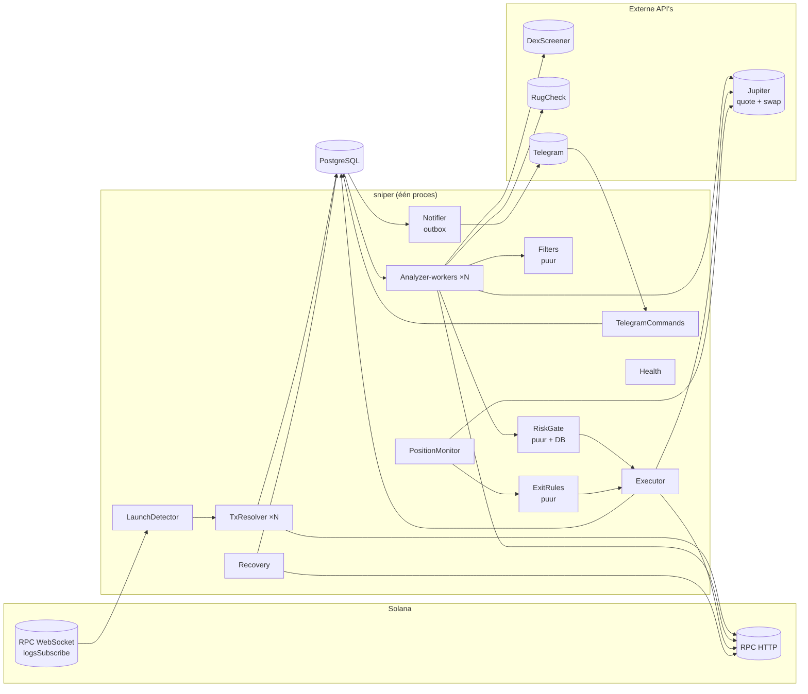
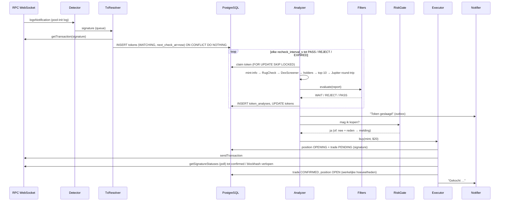
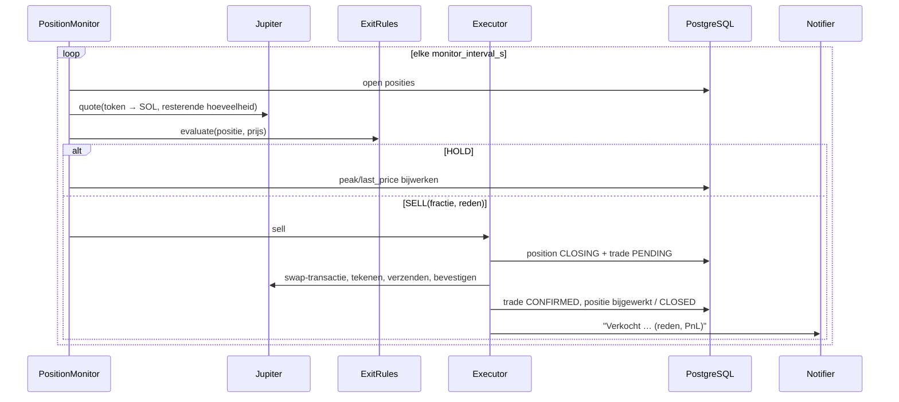
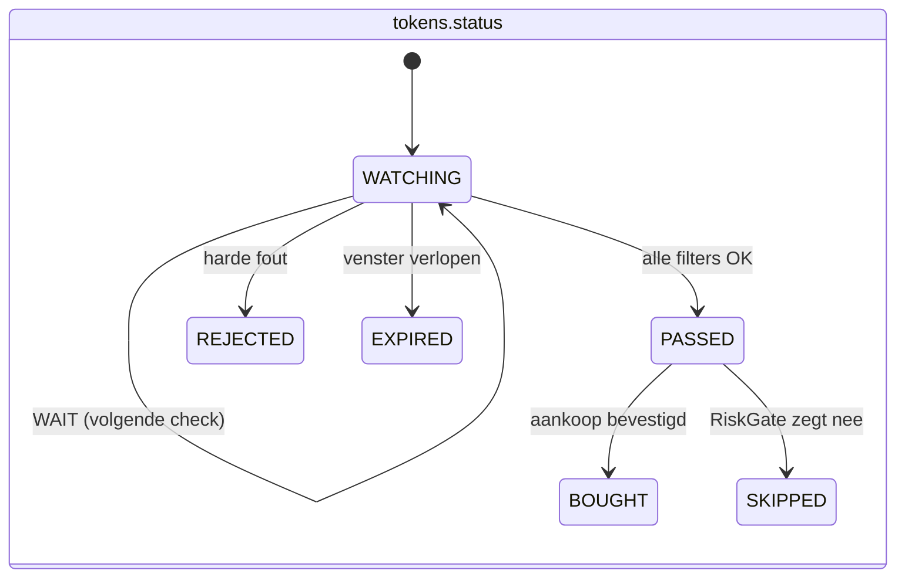
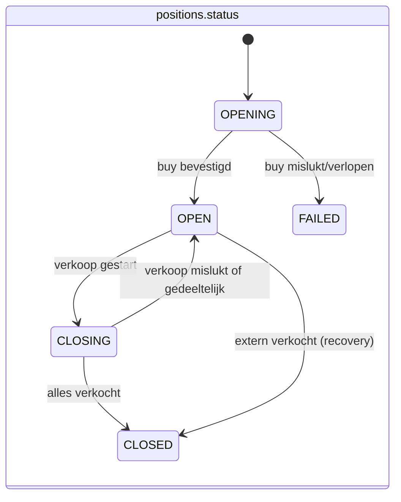
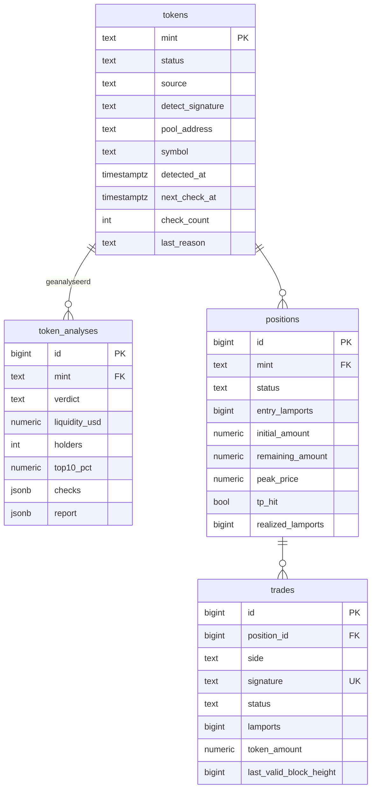

# Solana Sniper Bot — Architectuur, database en event flow

> Dit document is het ontwerp. De code in `src/sniper/` volgt het één-op-één;
> waar een module genoemd wordt, staat die tussen haakjes.

## 0. Wat deze bot wel en niet is

De koopvoorwaarden (≥ $25.000 liquiditeit, ≥ 100 holders, top-10 < 40%) kunnen
op het moment van lancering **per definitie niet** gehaald worden: een pool die
net is aangemaakt heeft nog geen 100 holders. De bot is daarom geen
"eerste-blok-sniper", maar een **realtime lanceringsdetector met een
watchlist**:

1. Een nieuwe pool wordt binnen enkele seconden gedetecteerd.
2. Het token komt op een watchlist en wordt periodiek opnieuw geanalyseerd
   (standaard elke 20 s, maximaal 30 min).
3. Harde scam-signalen (mint authority actief, freeze authority, gevaarlijke
   Token-2022-extensies, honeypot) → **direct en definitief afgewezen**.
4. Zachte voorwaarden (liquiditeit, holders, spreiding) → **blijven wachten**
   tot ze slagen of het venster verloopt.
5. Slagen alle filters → melding + (in `live`-modus) automatische aankoop.

Dat is bewust: de eerste seconden van een lancering zijn het domein van rug
pulls en bundel-bots. Wachten tot er echte spreiding is, kost wat potentieel
rendement en verkleint het risico aanzienlijk.

**Realistische verwachting.** Het overgrote deel van nieuwe Solana-tokens gaat
naar nul. Filters verlagen dat risico, ze elimineren het niet. Behandel elke
$20 als een bedrag dat je kwijt kunt raken.

## 1. Componenten

| Component | Module | Taak |
|---|---|---|
| **LaunchDetector** | `detector.py` | Eén `logsSubscribe`-abonnement per DEX-programma (Raydium AMM v4, Raydium CPMM, PumpSwap; optioneel pump.fun). Filtert logregels op het instructiepatroon dat een nieuwe pool aanmaakt en zet de transactiesignature op een begrensde queue. Automatisch herverbinden met exponentiële backoff. |
| **TxResolver** | `detector.py` | Haalt de transactie op (`getTransaction`), bepaalt de nieuwe mint uit `postTokenBalances` (de enige mint die geen SOL/USDC/USDT is) en schrijft het token in `tokens` met status `WATCHING`. `ON CONFLICT DO NOTHING` = automatische deduplicatie. |
| **Analyzer** | `analysis/analyzer.py` | N workers die met `SELECT … FOR UPDATE SKIP LOCKED` de tokens pakken waarvan `next_check_at` verstreken is. Verzamelt data in goedkope-eerst-volgorde en stopt zodra een check faalt (spaart rate limits). |
| **Filters** | `analysis/filters.py` | Pure functie: `TokenReport → Verdict (PASS / WAIT / REJECT + per-check resultaat)`. Geen I/O, volledig unit-getest. |
| **RiskGate** | `risk.py` | Laatste poort vóór een aankoop: modus, pauze, max. open posities, max. aankopen/uur, dagverlieslimiet, SOL-reserve, geen dubbele positie op hetzelfde token. |
| **Executor** | `executor.py` | Koop/verkoop via Jupiter. **Write-ahead**: de getekende transactie krijgt zijn signature vóór verzending; die signature gaat eerst in de database (`trades.status = PENDING`), daarna pas naar het netwerk. Na een crash kan de bot dus altijd vaststellen of de transactie geland is. Leest de werkelijk ontvangen hoeveelheden uit de bevestigde transactie. |
| **PositionMonitor** | `positions.py` | Elke 5 s per open positie: sell-quote voor de volledige resterende hoeveelheid → actuele *uitstapwaarde* (inclusief price impact) → ExitRules. |
| **ExitRules** | `exits.py` | Pure functie: stop-loss, take-profit (gedeeltelijk), trailing stop, optioneel max. houdtijd. |
| **Recovery** | `recovery.py` | Bij opstart: `PENDING`-trades afhandelen via `getSignatureStatuses` + blockhash-verloop, halfvoltooide posities corrigeren, on-chain saldi vergelijken met de database. |
| **Notifier** | `telegram.py` (`outbox_worker`) | Outbox-patroon: meldingen worden in dezelfde transactie als de gebeurtenis in `notifications` gezet; een worker verstuurt ze naar Telegram met retries. |
| **TelegramCommands** | `telegram.py` (`CommandHandler`) | `/status`, `/positions`, `/pause`, `/resume`, `/sell <id> CONFIRM`, `/sellall CONFIRM`. Alleen voor chat-ID's op de whitelist. |
| **Health** | `app.py` (`health_server`) | `GET /health` voor de Docker-healthcheck: DB bereikbaar, WebSocket recent actief. |

Gedeelde infrastructuur: `config.py` (YAML + validatie), `ratelimit.py` (token
bucket per externe dienst), `solana/rpc.py` (JSON-RPC-client met retries),
`solana/wallet.py`, `jupiter.py`, `analysis/sources.py` (DexScreener, RugCheck),
`db.py` (asyncpg-pool, migraties, queries), `solana/txparse.py` (mint en saldo-verschillen uit transacties halen).

## 2. Event flow

### 2.1 Van lancering tot aankoop

### 2.2 Positiebewaking en verkoop

### 2.3 Exit-regels (exacte semantiek)

`ratio = huidige prijs per token / instapprijs per token`, beide in SOL en
gemeten via een echte sell-quote (dus inclusief price impact).

1. **Stop-loss** — `ratio ≤ 1 − 20%` → verkoop alles.
2. **Take-profit** — eerste keer `ratio ≥ 1 + 50%` → verkoop
   `take_profit_sell_fraction` (standaard 50%). Is die fractie 1.0, dan is de
   positie gesloten.
3. **Trailing stop** — actief *na* de take-profit (instelbaar). Houdt de
   hoogste prijs bij; `prijs ≤ piek × (1 − 15%)` → verkoop de rest.
4. **Max. houdtijd** (optioneel, standaard uit).

Waarom trailing pas na TP: een trailing stop van 15% vanaf de instap zou
altijd vóór de stop-loss van 20% afgaan, waardoor die laatste nooit gebruikt
wordt. Met `trailing_activate_after_tp: false` gedraagt hij zich toch als
klassieke trailing stop vanaf instap.

### 2.4 Toestandsmachines

`trades.status`: `PENDING → CONFIRMED | FAILED`. Een `PENDING`-trade wordt
**nooit** opnieuw verstuurd; eerst wordt vastgesteld of hij geland is. Pas
als de blockhash verlopen is én de signature onbekend is, geldt hij als
`FAILED`.

## 3. Filters in detail

| Check | Bron | Uitkomst bij falen |
|---|---|---|
| Mint authority ingetrokken | RPC `getAccountInfo` (jsonParsed) | **REJECT** — dev kan onbeperkt bijminten |
| Freeze authority ingetrokken | idem | **REJECT** — dev kan jouw tokens bevriezen (honeypot) |
| Geen gevaarlijke Token-2022-extensies | idem | **REJECT** — `permanentDelegate`, `transferHook`, `transferFeeConfig`, `nonTransferable`, `defaultAccountState`, `pausableConfig` |
| Niet op denylist | config | **REJECT** |
| RugCheck-rapport | `api.rugcheck.xyz` | **REJECT** bij risico van niveau `danger` of te hoge score (instelbaar; uit te zetten) |
| Pool actief | DexScreener-pair met liquiditeit > 0 | WAIT |
| Liquiditeit ≥ $25.000 | DexScreener (grootste Solana-pair) | WAIT |
| Holders ≥ 100 | RPC `getProgramAccounts` (of Helius DAS) — unieke eigenaren met saldo > 0 | WAIT |
| Top-10 < 40% | RPC `getTokenLargestAccounts` + eigenaren; pool-vaults en andere programma-accounts (PDA, off-curve) en de burn-adressen tellen niet mee | WAIT |
| Verhandelbaar (round-trip) | Jupiter: quote SOL→token én token→SOL voor $20 | Geen route: WAIT. Round-trip-verlies > 10%: **REJECT** (verkoopbelasting/honeypot) |

Checks lopen in deze volgorde en stoppen bij de eerste die niet slaagt. Een
check waarvan de data (tijdelijk) niet beschikbaar is, geeft WAIT, nooit PASS.

## 4. Database-ontwerp (PostgreSQL)

Conventies: tijden `timestamptz` (UTC); SOL in lamports (`bigint`); token-
hoeveelheden in ruwe eenheden (`numeric(40,0)`); USD als `numeric`.

Volledige definitie: `migrations/001_init.sql`. Overige tabellen:

- **`notifications`** — outbox: `priority`, `body`, `status (PENDING/SENT/FAILED)`, `attempts`, `dedupe_key` (uniek).
- **`events`** — append-only auditlog van alle beslissingen en systeemgebeurtenissen (`kind`, `mint`, `position_id`, `data jsonb`).
- **`bot_state`** — key/value, o.a. `paused`.
- **`schema_migrations`** — toegepaste migraties.

Belangrijke constraints:

- `positions`: partiële unieke index op `mint` waar `status IN ('OPENING','OPEN','CLOSING')` → nooit twee actieve posities in hetzelfde token, ook niet bij een race.
- `trades.signature` uniek → dezelfde transactie kan niet dubbel geboekt worden.
- Index `tokens(status, next_check_at)` voor de analyzer-queue.

## 5. Risico's en maatregelen

| Risico | Maatregel |
|---|---|
| Rug pull (liquiditeit weggehaald) | RugCheck LP-checks, liquiditeitsdrempel, SL. Een rug pull kan sneller zijn dan elke SL; dat is inherent. |
| Honeypot / verkoopbelasting | Freeze authority, Token-2022-extensies, Jupiter round-trip-check. |
| Bundels / insiders met veel wallets | Top-10-drempel en holder-minimum; kan omzeild worden met veel kleine wallets — dat blijft een restrisico. |
| Slippage / sandwiching | Slippage-limiet per trade, priority fee met maximum; Jupiter-routes. |
| Transactie landt niet | Poll tot bevestiging of blockhash-verloop; nooit blind opnieuw versturen. |
| Crash tijdens een trade | Write-ahead signature + recovery bij opstart. |
| Wegvallende WebSocket | Automatisch herverbinden; health-check faalt als er te lang niets binnenkomt → Docker herstart. |
| Rate limits | Token bucket per dienst; aparte Jupiter-budgetten voor handel en analyse, zodat analyse nooit een verkoop vertraagt. |
| Gelekte private key | Aparte hot wallet met klein saldo, key alleen via env/secret-bestand, nooit in YAML of logs. |
| Fout in de configuratie | Strikte validatie; `paper` is de standaardmodus; `live` moet expliciet. |
| Bot draait twee keer | PostgreSQL advisory lock bij opstart. |

## 6. Beveiliging

- **Dedicated hot wallet**: alleen wat de bot mag riskeren (bijv. 3 × $20 + fees + reserve). Nooit je hoofdwallet.
- Private key via `SOLANA_PRIVATE_KEY` (base58) of een gemount keypair-bestand (`chmod 600`); nooit in de YAML, nooit gelogd.
- Telegram: whitelist van chat-ID's; verkoopcommando's vereisen `CONFIRM`; er bestaat geen commando om geld op te nemen of limieten te verruimen.
- Container draait als non-root; PostgreSQL alleen op het interne Docker-netwerk; geen poorten naar buiten behalve optioneel health op localhost.
- Afhankelijkheden vastgepind; alleen gevestigde bibliotheken (`solders`, `httpx`, `asyncpg`, `websockets`, `pydantic`).

## 7. Deployment (Ubuntu VPS)

- `docker compose up -d` start `postgres` (met volume) en `bot`; `restart: unless-stopped`; healthcheck op `/health`.
- Een betaalde RPC (Helius, QuickNode, Triton) is praktisch vereist: publieke RPC's blokkeren `logsSubscribe`-volume en `getProgramAccounts`.
- Backups: dagelijkse `pg_dump` via cron op de host.
- Uitrolpad: `paper` (echte data, gesimuleerde trades) → `live` met de standaardlimieten.
